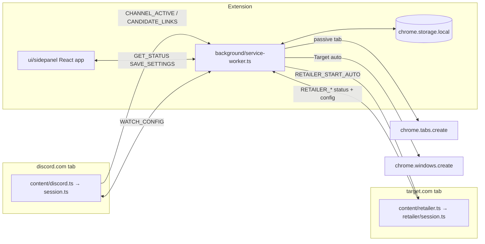

# CookieScripts — Agent Guide

Chrome MV3 extension that auto-opens allowlisted product links from Discord web channel messages. Fork of [Quarks-1/autoopen](https://github.com/Quarks-1/autoopen) concepts; no Discord user token.

**Docs:** [BUILD.md](./BUILD.md) — product spec and upstream porting index. [README.md](./README.md) — install, update, permissions. **This file — how the codebase works today** (BUILD.md is partially stale; trust this file + code for current behavior).

## Product model

- User keeps `https://discord.com/channels/*` open; a content script observes the message list DOM.
- **Side panel only** — no options page. Toolbar icon opens the side panel (`sidePanel` permission). Global enable slider; per-channel `allowed_domains` edited for the **active tab's channel** only.
- When enabled, every open Discord channel tab reports `CHANNEL_ACTIVE` in parallel. Empty allowlist = observe but do not open links.
- Non-Target matched links open via `chrome.tabs.create({ active: false })`. Target product links with per-channel `retailer_auto_enabled` open in a **new Chrome window** (`chrome.windows.create`) for automation.
- Distribution: manual zip from [GitHub Releases](https://github.com/Quarks-1/CookieScripts/releases) + side panel update nudge (not Chrome Web Store).

### BUILD.md vs reality

| BUILD.md may still say | Current code |
|---|---|
| Options page + manual watch targets | Removed — side panel is sole UI |
| Scan only pre-registered channels | Scan any channel tab when `enabled` |
| Domains required to attach observer | Domains gate **opening**, not observing |
| Popup as primary UI | Side panel is primary; `ui/popup/` is the shared React app |
| MVP checkboxes unchecked | Most v0.1 items shipped; see BUILD.md for stale checkboxes |

## Architecture



**Message routing:** `handlers.ts` dispatches to `discord-handlers.ts`, `retailer-handlers.ts`, or `ui-handlers.ts`. Each path validates `sender` via `sender-auth.ts` (Discord tab, Target tab, or extension page only).

## Side panel UI

Single React app (`ui/popup/App.tsx`) loaded from `ui/sidepanel/index.html`. Section visibility is tab-surface-aware (`ui/popup/sidepanel-layout.ts`):

| Active tab surface | Sections shown |
|---|---|
| `discord_channel` | Watch status, channel domains, detected links, link history |
| `retailer` | Target Auto Mode controls (when extension enabled) |
| `other` | Global hint (“open a Discord channel tab…”) |

Always visible: enable slider, version/update banner. `buildStatus` (`extension/background/status.ts`) derives `active_tab_kind` from the active tab URL and `active_channel_id` from the active Discord tab (or `activeChannels` map).

## Where to edit

| Area | Path | Notes |
|---|---|---|
| Discord content entry | `extension/content/discord.ts` | Thin entry; calls `startSession()` |
| Content orchestration | `extension/content/session.ts` | Channel sync, bootstrap, observer lifecycle |
| DOM selectors | `extension/content/selectors.ts` | **Only** Discord CSS selectors; bump `SELECTOR_VERSION` |
| Link extraction | `extension/content/extract.ts` | Use `textContent`, not `innerHTML` |
| Mutation observer | `extension/content/observers.ts` | Message pipeline wiring |
| SPA navigation | `extension/content/navigation.ts` | Re-sync on Discord route changes |
| Detected-domain scan | `extension/content/detected-domains.ts` | Page-load link suggestions for side panel |
| Retailer content entry | `extension/content/retailer.ts` | Thin entry; calls `startRetailerSession()` |
| Retailer automation | `extension/content/retailer/session.ts` | Auto/manual mode, playback, hard refresh |
| Service worker bootstrap | `extension/background/service-worker.ts` | No top-level await; gates on `initPromise` |
| Background router | `extension/background/handlers.ts` | Routes runtime messages to handler modules |
| Sender validation | `extension/background/sender-auth.ts` | Reject cross-origin message senders |
| Side panel setup | `extension/background/side-panel.ts` | `openPanelOnActionClick` on install |
| Runtime state | `extension/background/runtime-state.ts` | `activeChannels` map, dedup queue |
| Discord / link handlers | `extension/background/discord-handlers.ts`, `open-product-link.ts` | Watch config, candidate links, tab/window opening |
| Retailer handlers | `extension/background/retailer-handlers.ts`, `retailer-runtime-state.ts` | Auto queue, tab-ready, manual-stop sync |
| Popup / status handlers | `extension/background/ui-handlers.ts`, `status.ts` | Settings, history, `buildStatus` |
| Pure logic | `extension/lib/*` | Testable; minimize `chrome.*` in lib modules |
| Link pipeline | `extension/lib/process-links.ts`, `links.ts`, `validate.ts` | Dedup, allowlist filter, history entries |
| Retailer lib | `extension/lib/retailer/*` | Selectors, playback engine, cart retry, host detection |
| Side panel layout | `ui/popup/sidepanel-layout.ts` | Section visibility rules |
| Side panel hooks / components | `ui/popup/hooks/*`, `ui/popup/components/*` | One hook per feature area |
| Shared UI | `ui/shared/` | `DomainPills`, `LinkHistory`, `EnableSlider`, `WatchStatusBadge` |
| Dev UI preview | `ui/dev/` + `npm run dev:ui` | Mocked `chrome` APIs + scenario toolbar |
| Tests | `tests/` | Vitest; `happy-dom` for DOM tests |

## Storage (`extension/lib/constants.ts`)

| Key | Purpose |
|---|---|
| `cookiescripts:settings` | `{ enabled, channel_targets[] }` — targets created lazily from side panel |
| `cookiescripts:history` | Opened/duplicate/retailer events, cap `HISTORY_LIMIT` (200) |
| `cookiescripts:recentUrls` | Normalized dedup keys, cap `RECENT_URL_LIMIT` (500) |
| `cookiescripts:updateCheck` | GitHub release ETag cache |
| `cookiescripts:ignoredDomains` | Per-channel dismissed detected-link suggestions |

Other limits in constants: `MAX_URLS_PER_MESSAGE` (20), `RECENT_URLS_DEBOUNCE_MS` (1000).

## Runtime messages

Defined in `extension/types/index.ts`. **Content script never opens tabs** — delegate to the service worker.

**Discord content → background:** `CHANNEL_ACTIVE`, `CHANNEL_INACTIVE`, `CANDIDATE_LINKS`, `ADD_ALLOWED_DOMAIN`, `IGNORE_DOMAIN`

**Retailer content → background:** `RETAILER_PING`, `RETAILER_AUTO_STATUS`, `RETAILER_GET_AUTO_CONFIG`, `RETAILER_SET_REFRESH_INTERVAL`, `RETAILER_HARD_RELOAD`, `RETAILER_UI_STATE`, `RETAILER_GET_TAB_AUTO_STATE`, `RETAILER_SYNC_MANUAL_STOP`, `RETAILER_SYNC_MANUAL_START`

**Background → content:** `WATCH_CONFIG`, `PING`, `SCAN_DETECTED_DOMAINS`, `RETAILER_START_AUTO`, `RETAILER_STOP_AUTO`, `RETAILER_START_MANUAL_AUTO`

**Side panel ↔ background:** `GET_STATUS`, `GET_SETTINGS`, `SAVE_SETTINGS`, `GET_HISTORY`, `CLEAR_HISTORY`, `GET_DETECTED_DOMAINS`, `SET_RETAILER_AUTO_ENABLED`, `SET_RETAILER_REFRESH_INTERVAL`, `RETAILER_START_MANUAL_AUTO`, `RETAILER_STOP_MANUAL_AUTO`

## Link opening

1. Content sends `CANDIDATE_LINKS` with extracted URLs.
2. `process-links.ts` filters by allowlist, dedupes via `recentUrlKeys`, caps at `MAX_URLS_PER_MESSAGE`.
3. For each URL to open:
   - **Target product + `retailer_auto_enabled`:** `openRetailerProductWindow` → new window, wait for tab ready, send `RETAILER_START_AUTO`. One retailer job at a time (`tryAcquireRetailerJob`); excess links are queued.
   - **Everything else:** `openPassiveProductTab` → `chrome.tabs.create({ active: false })`.

Affiliate URLs are unwrapped before host matching (`affiliate-unwrap.ts`). Target detection uses `isRetailerProductUrl` (pathname contains `/p/`).

## Target Auto Mode (retailer)

Per-channel `retailer_auto_enabled` on `ChannelTarget` (UI toggle visible when `target.com` is allowlisted on a Discord tab). When enabled, Target product links from Discord open in a focused new window; content script runs add-to-cart automation (built-in selectors in `extension/lib/retailer/selectors.ts`) and navigates to `/checkout/start`.

**Manual mode on Target tabs:** Side panel on an active `target.com` tab shows Start/Stop Auto Mode (`RETAILER_START_MANUAL_AUTO` / `RETAILER_STOP_MANUAL_AUTO`). Uses `channel_id: "manual"` for refresh-interval settings. Recording/playback profiles were removed in v0.1.11 — automation is selector-driven only.

**Hard refresh:** `retailer_refresh_interval_sec` on `ChannelTarget` (or global manual default) triggers periodic `RETAILER_HARD_RELOAD` when the main add-to-cart button is absent.

After manifest or service-worker changes, reload the extension and refresh Discord **and** Target tabs.

## Critical invariants / footguns

1. **Bootstrap on page load** — Seed existing message IDs into `seenMessageIds` on attach; hold link processing for `MESSAGE_BOOTSTRAP_QUIET_MS` (500ms) while Discord batches initial DOM. Without this, every historical link opens on load.
2. **Extension context invalidated** — After extension reload, stale content scripts must call `endSession()` and stop retrying `syncChannel`. Swallow invalidated errors in `requestWatchConfig` (`extension/lib/messages.ts`).
3. **Auto-scan semantics** — `watchConfigResponse` returns `channel_id` when `enabled` even if `allowed_domains` is `[]`. `isChannelActive` is `channel_id !== null`. `process-links.ts` no-ops on empty allowlist.
4. **Discord selectors** — Expect breakage; patch `selectors.ts` only, not core logic. Bump `SELECTOR_VERSION` when verified.
5. **Detected links UI** — Lives in side panel (`DetectedLinksSection`), never as page overlays.
6. **Domain suggestions** — Canonicalize CDN/affiliate hosts via `suggestion-domains.ts` (`CANONICAL_SUFFIXES`); filter noise via `blocked-domains.ts` and `ignored-domains.ts`.
7. **No Discord token** — Never add `cookies`, `webRequest`, or `<all_urls>` permissions.
8. **CRXJS manifest** — Root `manifest.json` references **source** `.ts` / `.html` entrypoints, not `dist/` paths.
9. **Version check** — Conditional GET to GitHub on every side panel open (ETag); 304 reuses cache. No time-based skip (`check-for-update.ts`).
10. **After service-worker changes** — Reload on `chrome://extensions`; refresh Discord and Target tabs to avoid stale content scripts.
11. **Sender auth** — Handlers reject messages from wrong origins. Do not bypass `sender-auth.ts`.
12. **MV3 service worker** — No top-level `await`. Gate listeners on `initPromise` in `service-worker.ts`.
13. **Thread URLs** — `parseChannelId` uses the parent channel segment (`/channels/guild/parent/thread` → `parent`). Thread and parent share one allowlist.
14. **Side panel sections** — UI sections are gated by `active_tab_kind`; do not assume link history or domains editor appear on non-Discord tabs.
15. **Multi-tab** — `activeChannels` maps tab IDs to channel IDs; multiple Discord tabs can be watched simultaneously.

## Dev & test

```bash
npm install
npm run dev        # extension HMR (CRXJS + Vite)
npm run dev:ui     # side panel in browser with mocked chrome APIs
npm run build      # tsc -b && vite build → dist/
npm test           # vitest run
npm run test:watch # vitest watch mode
npm run package    # build + zip
```

**Stack:** Node 20+, React 19, Tailwind CSS 4, Vite 7, `@crxjs/vite-plugin`. Path aliases: `@ext` → `extension/`, `@shared` → `ui/shared/`. Unused imports fail `tsc -b`.

**`dev:ui` scenarios** (bottom toolbar): Watching channel, Active/no domains, No Discord tab, On Target (auto mode), On Target (manual only). Use these to exercise all side panel surfaces without a live Discord session.

## CI & release

- `.github/workflows/ci.yml` — `npm ci && npm test && npm run build` on PR/main.
- `.github/workflows/release.yml` — every `main` push → patch version commit `[skip ci]` → tag `vX.Y.Z` → attach `cookiescripts-X.Y.Z.zip`.
- `git pull` after merges to pick up bot version bumps.

## Porting from autoopen

When changing link parsing, validation, or domain matching, check BUILD.md “Logic to port”. Primary files: `extension/lib/links.ts`, `validate.ts`, `affiliate-unwrap.ts`.

## Non-goals

- Chrome Web Store publishing
- Options page or manual channel-ID entry UI
- Firefox/Safari ports
- Gateway listener or stored Discord user token
- Detecting links added by message edits (planned v0.2+)
- Target selector recording / custom playback profiles (removed v0.1.11)

## Cursor Cloud specific instructions

Standard commands live in the `Dev & test` section above and in `package.json`. Notes below are non-obvious caveats for running/testing in this VM.

- **Loading the built extension**: `npm run build` emits to `dist/` with `manifest.json` at its root; load it via `chrome://extensions` → Developer mode → Load unpacked → select `/workspace/dist`. The service worker card shows "service worker (inactive)" until woken — that is normal MV3 behavior, not an error.
- **Opening the UI**: Click the toolbar icon to open the **side panel** (persists across tab reloads). `chrome-extension://<id>/ui/sidepanel/index.html` is blocked if navigated to directly (`ERR_BLOCKED_BY_CLIENT`).
- **Testing per-channel domain editor and link auto-opening requires a logged-in Discord channel tab.** `buildStatus` derives `active_channel_id` from the active tab's `https://discord.com/channels/<guild>/<channel>` URL; without a Discord session, Discord redirects to login so no channel is detected and the side panel shows the global hint with domains disabled. To exercise the full React UI without Discord, run `npm run dev:ui` and use the scenario buttons in the bottom toolbar.
- **Flows that work without Discord login** (on `other` tab surface): enable/disable toggle (persists via `SAVE_SETTINGS` → `chrome.storage.local`) and the GitHub version check (live GET to `api.github.com`). Link history and domain editing require the `discord_channel` surface — use `dev:ui` scenarios to preview them.
- **Target Auto Mode testing** requires a `target.com` product page tab; use the `retailer_auto` or `target_manual` dev:ui scenarios to preview side panel controls without Target login.
