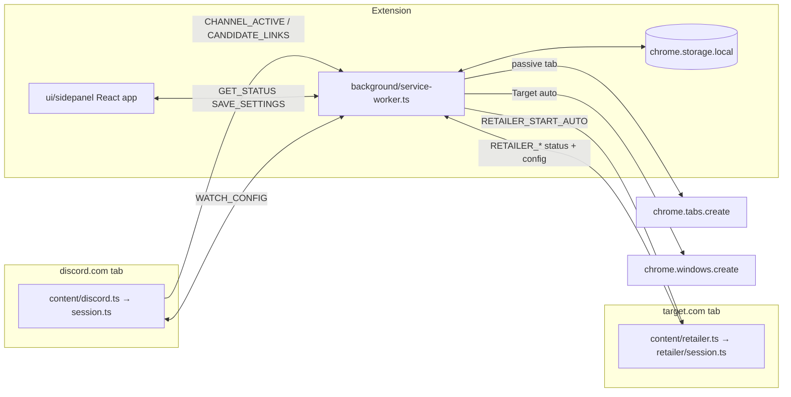

# CookieScripts — Agent Guide

Chrome MV3 extension that auto-opens allowlisted product links from Discord web channel messages. Fork of [Quarks-1/autoopen](https://github.com/Quarks-1/autoopen) concepts; no Discord user token.

**Docs:** [BUILD.md](./BUILD.md) — product spec and upstream porting index. [README.md](./README.md) — install, update, permissions. **This file — how the codebase works today** (BUILD.md is partially stale; trust this file + code for current behavior).

**Start here when coding:** read `extension/types/index.ts` for message and settings shapes, then the handler or content module you are changing. Prefer pure logic in `extension/lib/*` with Vitest coverage; keep `chrome.*` in background/content layers.

## Product model

- User keeps `https://discord.com/channels/*` open; a content script observes the message list DOM.
- **Side panel only** — no options page. Toolbar icon opens the side panel (`sidePanel` permission). Global enable slider; per-channel `allowed_domains` edited for the **active tab's channel** only.
- When enabled, every open Discord channel tab reports `CHANNEL_ACTIVE` in parallel. Empty allowlist = observe but do not open links.
- Non-Target matched links open via `chrome.tabs.create({ active: false })`. Target product links with per-channel `retailer_auto_enabled` open in a **new Chrome window** (`chrome.windows.create`) for automation.
- Distribution: manual zip from [GitHub Releases](https://github.com/Quarks-1/CookieScripts/releases) + side panel update nudge (not Chrome Web Store).

### BUILD.md vs reality

| BUILD.md may still say | Current code |
|---|---|
| Options page + manual watch targets | Removed — side panel is sole UI |
| Scan only pre-registered channels | Scan any channel tab when `enabled` |
| Domains required to attach observer | Domains gate **opening**, not observing |
| Popup as primary UI | Side panel is primary; `ui/popup/` is the shared React app |
| MVP checkboxes unchecked | Most v0.1 items shipped; see BUILD.md for stale checkboxes |

## Repository layout

| Path | Role |
|---|---|
| `extension/` | MV3 extension: background service worker, content scripts, shared lib |
| `extension/types/` | Runtime message unions, settings/status interfaces — **source of truth** |
| `ui/sidepanel/` | Production side panel entry (`index.html`, `main.tsx` → `ui/popup/App.tsx`) |
| `ui/popup/` | Shared React app (hooks, components, layout) — name is legacy |
| `ui/shared/` | Reusable UI primitives (`DomainPills`, `LinkHistory`, …) |
| `ui/dev/` | Browser preview with mocked `chrome` APIs (`npm run dev:ui`) |
| `public/injected/` | Web-accessible page-context scripts (cart probe) |
| `tests/` | Vitest unit tests (`*.test.ts`) |
| `research/`, `scripts/target-*.mjs` | Target PDP/cart research — not shipped |
| `manifest.json` | CRXJS source manifest (`.ts` entrypoints, not `dist/`) |
| `vite.config.ts` | Extension build; `vite.dev.config.ts` for `dev:ui` only |

## Manifest & permissions

| Permission / host | Why |
|---|---|
| `storage` | Settings, history, dedup keys, update-check cache |
| `tabs` | Open passive product tabs and release download links |
| `windows` | Open Target Auto Mode in a focused window |
| `sidePanel` | Toolbar icon opens the side panel |
| `discord.com` | Discord content script |
| `target.com` / `www.target.com` | Retailer content script + cart probe injection |
| `carts.target.com` | Backend ATC cart API (page-context probe) |
| `api.github.com` | Anonymous release version check |

Never add `cookies`, `webRequest`, or `<all_urls>`. Content scripts never open tabs — the service worker does.

## Architecture



**Message routing:** `handlers.ts` dispatches to `discord-handlers.ts`, `retailer-handlers.ts`, or `ui-handlers.ts`. Each path validates `sender` via `sender-auth.ts` (Discord tab, Target tab, or extension page only). Shared send/receive helpers live in `extension/lib/messages.ts`.

## Side panel UI

Single React app (`ui/popup/App.tsx`) loaded from `ui/sidepanel/index.html`. Section visibility is tab-surface-aware (`ui/popup/sidepanel-layout.ts`):

| Active tab surface | Sections shown |
|---|---|
| `discord_channel` | Watch status, channel domains, detected links, link history |
| `retailer` | Target Auto Mode controls (when extension enabled) |
| `other` | Global hint ("open a Discord channel tab…") |

Always visible: enable slider, version/update banner.

**Target ATC toggles** (`TargetAtcToggles`) appear when `retailer_tab_detected` (active tab is `target.com`). They are global settings — not per-channel — and sit outside `sidepanel-layout.ts` gating. Defaults: Frontend ATC on, Backend ATC off; at least one must stay enabled.

### `buildStatus` (`extension/background/status.ts`)

`active_tab_kind` comes from `extension/lib/active-tab.ts` (`discord_channel` | `retailer` | `other`).

| Field | Meaning |
|---|---|
| `active_channel_id` | Parsed from the **active** Discord tab URL, or from `activeChannels` for that tab. `null` on non-Discord active tabs. |
| `is_active` | `enabled && active_channel_id !== null` |
| `discord_tab_detected` | Active tab is Discord **or** any watched Discord tab is connected |
| `retailer_tab_detected` | Active tab URL is Target |
| `allowed_domains` / `has_allowed_domains` | From settings for `active_channel_id` (empty when null) |
| `retailer_auto_enabled` | Per-channel flag **and** `target.com` in that channel's allowlist (`allowlistIncludesRetailerHost`) |
| `retailer_refresh_interval_sec` | Per-channel on Discord; global `manual` default on Target-only sessions |
| `retailer_manual_*` | Live automation status from `retailer-runtime-state.ts` for the active Target tab |

Domain edits debounce 400ms (`useChannelDomainsEditor`) and persist via `saveChannelDomains` to `active_channel_id` from a fresh `GET_STATUS`. `channel_targets[]` rows are created lazily on first save.

## Where to edit

| Area | Path | Notes |
|---|---|---|
| Discord content entry | `extension/content/discord.ts` | Thin entry; calls `startSession()` |
| Content orchestration | `extension/content/session.ts` | Channel sync, bootstrap, observer lifecycle; skips own messages |
| DOM selectors | `extension/content/selectors.ts` | **Only** Discord CSS selectors; bump `SELECTOR_VERSION` |
| Link extraction | `extension/content/extract.ts` | `textContent` + `a[href]`; not `innerHTML` |
| Mutation observer | `extension/content/observers.ts` | Message pipeline wiring |
| SPA navigation | `extension/content/navigation.ts` | Re-sync on Discord route changes |
| Detected-domain scan | `extension/content/detected-domains.ts` | Page-load link suggestions for side panel |
| Retailer content entry | `extension/content/retailer.ts` | Thin entry; calls `startRetailerSession()` |
| Retailer automation | `extension/content/retailer/session.ts` | Auto/manual mode, ATC config cache, hard refresh |
| Retailer playback | `extension/content/retailer/automation/playback.ts` | Selector-driven automation steps |
| Retailer wait loop | `extension/lib/retailer/waiting-disabled.ts`, `restock-wait.ts` | Disabled ATC polling, restock vs OOS signals |
| Retailer hard refresh | `extension/lib/retailer/page-refresh.ts`, `auto-resume.ts` | Interval reload; `sessionStorage` resume across reloads |
| Retailer ATC | `extension/lib/retailer/main-add-to-cart.ts`, `cart-api.ts` | Frontend click vs backend cart API |
| Cart probe bridge | `extension/lib/retailer/page-cart-probe-bridge.ts` | Injects `public/injected/cart-probe.js` |
| Service worker bootstrap | `extension/background/service-worker.ts` | No top-level await; gates on `initPromise` |
| Background router | `extension/background/handlers.ts` | Routes runtime messages to handler modules |
| Sender validation | `extension/background/sender-auth.ts` | Reject cross-origin message senders |
| Side panel setup | `extension/background/side-panel.ts` | `openPanelOnActionClick` on install |
| Runtime state | `extension/background/runtime-state.ts` | `activeChannels` map, dedup queue |
| Discord / link handlers | `extension/background/discord-handlers.ts`, `open-product-link.ts` | Watch config, candidate links, tab/window opening |
| Retailer tab ready | `extension/background/retailer-tab-ready.ts`, `retailer-tab-message.ts` | Wait for Target tab before `RETAILER_START_AUTO` |
| Retailer handlers | `extension/background/retailer-handlers.ts`, `retailer-runtime-state.ts` | Auto queue, tab-ready, manual-stop sync |
| UI / status handlers | `extension/background/ui-handlers.ts`, `status.ts` | Settings, history, `buildStatus` |
| Message helpers | `extension/lib/messages.ts` | `sendToBackground`, watch config, invalidated-context handling |
| Pure logic | `extension/lib/*` | Testable; minimize `chrome.*` in lib modules |
| Link pipeline | `extension/lib/process-links.ts`, `links.ts`, `validate.ts` | `decideLinkActions` — dedup, allowlist, history |
| Channel settings | `extension/lib/channel-targets.ts`, `retailer/channel-config.ts` | Per-channel domains and retailer flags |
| Side panel layout | `ui/popup/sidepanel-layout.ts` | Section visibility rules |
| Side panel hooks / components | `ui/popup/hooks/*`, `ui/popup/components/*` | One hook per feature area |
| Shared UI | `ui/shared/` | `DomainPills`, `LinkHistory`, `EnableSlider`, `WatchStatusBadge` |
| Dev UI preview | `ui/dev/` + `npm run dev:ui` | `chrome-mock.ts`, `mock-store.ts`, scenario toolbar |
| Tests | `tests/` | Vitest; `happy-dom` for DOM tests |
| Target research | `research/TARGET_AUTOMATION.md`, `scripts/target-*.mjs` | Live PDP/cart research artifacts (not shipped) |

## Storage (`extension/lib/constants.ts`)

| Key | Purpose |
|---|---|
| `cookiescripts:settings` | `{ enabled, channel_targets[], retailer_* }` — targets created lazily from side panel |
| `cookiescripts:history` | Opened/duplicate/retailer events, cap `HISTORY_LIMIT` (200) |
| `cookiescripts:recentUrls` | Normalized dedup keys, cap `RECENT_URL_LIMIT` (500) |
| `cookiescripts:updateCheck` | GitHub release ETag cache |
| `cookiescripts:ignoredDomains` | Per-channel dismissed detected-link suggestions |

**Link history kinds** (`HistoryItemKind` in `extension/types/index.ts`): `opened`, `duplicate`, `retailer_window_opened`, `retailer_auto_queued`, `retailer_auto_success`, `retailer_auto_failed`.

Other limits in constants: `MAX_URLS_PER_MESSAGE` (20), `RECENT_URLS_DEBOUNCE_MS` (1000).

**Per-channel** on `ChannelTarget`: `allowed_domains`, `retailer_auto_enabled`, `retailer_refresh_interval_sec`.

**Global** on `ExtensionSettings`: `retailer_refresh_interval_sec` (manual-mode default), `retailer_frontend_atc_enabled` (default on), `retailer_backend_atc_enabled` (default off).

**Target tab `sessionStorage`** (not `chrome.storage`): `cookiescripts:retailerAutoResume`, `cookiescripts:retailerAutoUserStopped` — survive hard reloads during automation (`auto-resume.ts`).

## Runtime messages

Defined in `extension/types/index.ts`. **Content script never opens tabs** — delegate to the service worker.

**Discord content → background:** `CHANNEL_ACTIVE`, `CHANNEL_INACTIVE`, `CANDIDATE_LINKS`, `ADD_ALLOWED_DOMAIN`, `IGNORE_DOMAIN`

**Retailer content → background:** `RETAILER_PING`, `RETAILER_AUTO_STATUS`, `RETAILER_GET_AUTO_CONFIG`, `RETAILER_SET_REFRESH_INTERVAL`, `RETAILER_HARD_RELOAD`, `RETAILER_UI_STATE`, `RETAILER_GET_TAB_AUTO_STATE`, `RETAILER_SYNC_MANUAL_STOP`, `RETAILER_SYNC_MANUAL_START`

**Background → content:** `WATCH_CONFIG`, `PING`, `SCAN_DETECTED_DOMAINS`, `RETAILER_PING`, `RETAILER_START_AUTO`, `RETAILER_STOP_AUTO`, `RETAILER_START_MANUAL_AUTO`

**Side panel ↔ background:** `GET_STATUS`, `GET_SETTINGS`, `SAVE_SETTINGS`, `GET_HISTORY`, `CLEAR_HISTORY`, `GET_DETECTED_DOMAINS`, `SET_RETAILER_AUTO_ENABLED`, `SET_RETAILER_REFRESH_INTERVAL`, `SET_RETAILER_ATC_MODES`, `RETAILER_START_MANUAL_AUTO`, `RETAILER_STOP_MANUAL_AUTO`

## Link opening

1. Observer delivers new messages; **own messages are skipped** (`isOwnMessage` in `extract.ts` / `session.ts`).
2. Content sends `CANDIDATE_LINKS` with URLs from visible text and `a[href]` (affiliate unwrap in `affiliate-unwrap.ts`).
3. `decideLinkActions` in `process-links.ts` filters by allowlist, dedupes via `recentUrlKeys`, caps at `MAX_URLS_PER_MESSAGE`. No-op when `!enabled` or empty allowlist.
4. For each URL to open:
   - **Target product + `retailer_auto_enabled`:** `openRetailerProductWindow` → new window, wait for tab ready (`retailer-tab-ready.ts`), send `RETAILER_START_AUTO` with retries. One retailer job at a time (`tryAcquireRetailerJob`); excess links are queued.
   - **Everything else:** `openPassiveProductTab` → `chrome.tabs.create({ active: false })`.

Target detection uses `isRetailerProductUrl` (pathname contains `/p/`).

## Target Auto Mode (retailer)

Per-channel `retailer_auto_enabled` on `ChannelTarget`. When enabled, Target product links from Discord open in a focused new window; content script runs add-to-cart automation and navigates to `/checkout/start`.

**Discord auto toggle** ("Auto-open from Discord") lives in `RetailerAutoModeSection` on the **retailer** surface. It requires `active_channel_id`, `target.com` in that channel's allowlist, and extension enabled. Because `buildStatus` only derives `active_channel_id` from the **active** Discord tab, the toggle is not available when the side panel is opened from a Target-only session — use `dev:ui` scenario **On Target (auto mode)** to preview the full control set.

**Add-to-cart methods** (global toggles in side panel on Target tabs):

| Mode | Setting key | Default | Mechanism |
|---|---|---|---|
| Frontend ATC | `retailer_frontend_atc_enabled` | on | DOM button click via `main-add-to-cart.ts` + `selectors.ts` |
| Backend ATC | `retailer_backend_atc_enabled` | off | Cart API POST via `cart-api.ts`; requests run in page context through `public/injected/cart-probe.js` (`page-cart-probe-bridge.ts`) so Target session cookies apply |

At least one ATC method must remain enabled. Config is fetched by retailer content via `RETAILER_GET_AUTO_CONFIG` and cached in `retailer/session.ts`.

**Manual mode on Target tabs:** Start/Stop Auto Mode (`RETAILER_START_MANUAL_AUTO` / `RETAILER_STOP_MANUAL_AUTO`). Uses `channel_id: "manual"` for refresh-interval settings. Recording/playback profiles were removed in v0.1.11 — automation is selector-driven only.

**Waiting for ATC / restock:** When the main add-to-cart button is disabled, `runWaitingDisabledTick` (`waiting-disabled.ts`) publishes status from `restock-wait.ts` ("Waiting for restock…" vs "Waiting for main Add to cart…"), optionally probes the cart API (backend ATC), and triggers hard refresh on interval. See `research/TARGET_AUTOMATION.md` for Target DOM signals.

**Hard refresh:** `retailer_refresh_interval_sec` on `ChannelTarget` (or global manual default) triggers periodic `RETAILER_HARD_RELOAD`. `auto-resume.ts` stores resume state in `sessionStorage` so automation continues after reload unless the user stopped it.

After manifest or service-worker changes, reload the extension and refresh Discord **and** Target tabs.

## Critical invariants / footguns

1. **Bootstrap on page load** — Seed existing message IDs into `seenMessageIds` on attach; hold link processing for `MESSAGE_BOOTSTRAP_QUIET_MS` (500ms) while Discord batches initial DOM. Without this, every historical link opens on load.
2. **Extension context invalidated** — After extension reload, stale content scripts must call `endSession()` and stop retrying `syncChannel`. Swallow invalidated errors in `requestWatchConfig` (`extension/lib/messages.ts`).
3. **Auto-scan semantics** — `watchConfigResponse` returns `channel_id` when `enabled` even if `allowed_domains` is `[]`. `isChannelActive` is `channel_id !== null`. `process-links.ts` no-ops on empty allowlist.
4. **Discord selectors** — Expect breakage; patch `selectors.ts` only, not core logic. Bump `SELECTOR_VERSION` when verified.
5. **Detected links UI** — Lives in side panel (`DetectedLinksSection`), never as page overlays.
6. **Domain suggestions** — Canonicalize CDN/affiliate hosts via `suggestion-domains.ts` (`CANONICAL_SUFFIXES`); filter noise via `blocked-domains.ts` and `ignored-domains.ts`.
7. **No Discord token** — Never add `cookies`, `webRequest`, or `<all_urls>` permissions.
8. **CRXJS manifest** — Root `manifest.json` references **source** `.ts` / `.html` entrypoints, not `dist/` paths.
9. **Version check** — Conditional GET to GitHub on every side panel open (ETag); 304 reuses cache. No time-based skip (`check-for-update.ts`).
10. **After service-worker changes** — Reload on `chrome://extensions`; refresh Discord and Target tabs to avoid stale content scripts.
11. **Sender auth** — Handlers reject messages from wrong origins. Do not bypass `sender-auth.ts`.
12. **MV3 service worker** — No top-level `await`. Gate listeners on `initPromise` in `service-worker.ts`.
13. **Thread URLs** — `parseChannelId` uses the parent channel segment (`/channels/guild/parent/thread` → `parent`). Thread and parent share one allowlist.
14. **Side panel sections** — UI sections are gated by `active_tab_kind`; do not assume link history or domains editor appear on non-Discord tabs. ATC toggles are the exception (shown on any Target tab).
15. **Multi-tab** — `activeChannels` maps tab IDs to channel IDs; multiple Discord tabs can be watched simultaneously.
16. **Backend ATC** — Cart API calls must run in page context (injected probe), not from the content script directly. `carts.target.com` is a separate host permission from `target.com`.
17. **Own messages** — Never process links from the user's own Discord messages.
18. **Retailer auto UI vs status** — `retailer_auto_enabled` in `GET_STATUS` is false unless Target is allowlisted; removing `target.com` from domains clears the stored flag (`channel-targets.ts`).
19. **Lazy channel rows** — Editing domains for a channel creates its `channel_targets` entry on first save; there is no pre-registration UI.

## Working on this codebase

1. **Types first** — Add or change message types in `extension/types/index.ts`, then update `handlers.ts` routing and the sender module.
2. **Pure logic + tests** — Put decision logic in `extension/lib/*` and cover with `tests/*.test.ts`. Run `npm test` before committing.
3. **Discord DOM changes** — Only touch `extension/content/selectors.ts`; bump `SELECTOR_VERSION` after manual verification.
4. **Target automation** — Read `research/TARGET_AUTOMATION.md` for live PDP behavior; keep selectors in `extension/lib/retailer/selectors.ts`.
5. **UI changes** — Use `npm run dev:ui` and scenario toolbar for all side panel surfaces without Discord/Target login. Production entry is `ui/sidepanel/`, not `ui/popup/index.html`.
6. **Extension reload** — `npm run dev` HMR helps for UI; service worker and manifest changes need a manual reload on `chrome://extensions` plus tab refresh.

## Dev & test

```bash
npm install
npm run dev        # extension HMR (CRXJS + Vite)
npm run dev:ui     # side panel in browser with mocked chrome APIs
npm run build      # tsc -b && vite build → dist/
npm test           # vitest run
npm run test:watch # vitest watch mode
npm run package    # build + zip
```

**Stack:** Node 20+, React 19, Tailwind CSS 4, Vite 7, `@crxjs/vite-plugin`. Path aliases: `@ext` → `extension/`, `@shared` → `ui/shared/` (`@dev` in dev config only). TypeScript project references: `tsconfig.app.json` (extension + ui + tests), `tsconfig.node.json` (Vite configs). Unused imports fail `tsc -b`.

**`dev:ui`** (`vite.dev.config.ts` → `ui/dev/popup.html`): mocked `chrome.runtime.sendMessage` routes to `mock-store.ts`. Bottom toolbar scenarios:

| Scenario | Exercises |
|---|---|
| Watching channel | Discord surface with domains + history |
| Active, no domains | Discord channel, empty allowlist |
| No Discord tab | `other` surface + global hint |
| On Target (auto mode) | Retailer surface + Discord auto toggle (mocked `active_channel_id`) |
| On Target (manual only) | Retailer surface, manual start/stop only |

Toolbar also has Reset sample data, Empty settings, Add history item.

## CI & release

- `.github/workflows/ci.yml` — `npm ci && npm test && npm run build` on PR/main.
- `.github/workflows/release.yml` — every `main` push (except `[skip ci]` commits) → bump `manifest.json` + `package.json` patch → test + build → zip → version commit `[skip ci]` → tag `vX.Y.Z` → GitHub Release asset.
- `git pull` after merges to pick up bot version bumps.

## Porting from autoopen

When changing link parsing, validation, or domain matching, check BUILD.md "Logic to port". Primary files: `extension/lib/links.ts`, `validate.ts`, `affiliate-unwrap.ts`.

## Non-goals

- Chrome Web Store publishing
- Options page or manual channel-ID entry UI
- Firefox/Safari ports
- Gateway listener or stored Discord user token
- Detecting links added by message edits (planned v0.2+)
- Target selector recording / custom playback profiles (removed v0.1.11)

## Cursor Cloud specific instructions

Standard commands live in the `Dev & test` section above and in `package.json`. Notes below are non-obvious caveats for running/testing in this VM.

- **Loading the built extension**: `npm run build` emits to `dist/` with `manifest.json` at its root; load it via `chrome://extensions` → Developer mode → Load unpacked → select `/workspace/dist`. The service worker card shows "service worker (inactive)" until woken — that is normal MV3 behavior, not an error.
- **Opening the UI**: Click the toolbar icon to open the **side panel** (persists across tab reloads). `chrome-extension://<id>/ui/sidepanel/index.html` is blocked if navigated to directly (`ERR_BLOCKED_BY_CLIENT`).
- **Testing per-channel domain editor and link auto-opening requires a logged-in Discord channel tab.** `buildStatus` derives `active_channel_id` from the active tab's `https://discord.com/channels/<guild>/<channel>` URL; without a Discord session, Discord redirects to login so no channel is detected and the side panel shows the global hint with domains disabled. To exercise the full React UI without Discord, run `npm run dev:ui` and use the scenario buttons in the bottom toolbar.
- **Flows that work without Discord login** (on `other` tab surface): enable/disable toggle (persists via `SAVE_SETTINGS` → `chrome.storage.local`) and the GitHub version check (live GET to `api.github.com`). Link history and domain editing require the `discord_channel` surface — use `dev:ui` scenarios to preview them.
- **Target Auto Mode testing** requires a `target.com` product page tab for live automation; use the `retailer_auto` or `target_manual` dev:ui scenarios to preview side panel controls (including ATC toggles) without Target login.
