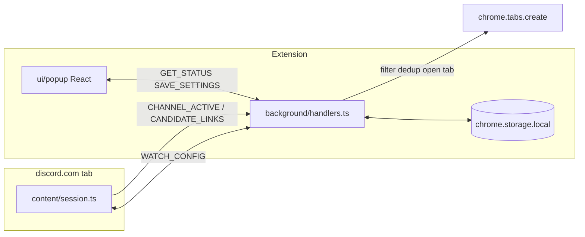

# CookieScripts — Agent Guide

Chrome MV3 extension that auto-opens allowlisted product links from Discord web channel messages. Fork of [Quarks-1/autoopen](https://github.com/Quarks-1/autoopen) concepts; no Discord user token.

**Docs:** [BUILD.md](./BUILD.md) — product spec and upstream porting index. [README.md](./README.md) — install, update, permissions. **This file — how the codebase works today** (BUILD.md is partially stale; trust this file + code for current behavior).

## Product model

- User keeps `https://discord.com/channels/*` open; a content script observes the message list DOM.
- **Popup only** — no options page. Global enable slider; per-channel `allowed_domains` edited for the **active tab's channel** only.
- When enabled on a Discord channel tab, the extension **auto-scans** messages. Empty allowlist = observe but do not open links.
- Matched links open via `chrome.tabs.create({ active: false })` in the service worker.
- Distribution: manual zip from [GitHub Releases](https://github.com/Quarks-1/CookieScripts/releases) + popup update nudge (not Chrome Web Store).

### BUILD.md vs reality

| BUILD.md may still say | Current code |
|---|---|
| Options page + manual watch targets | Removed — popup is sole UI |
| Scan only pre-registered channels | Scan any channel tab when `enabled` |
| Domains required to attach observer | Domains gate **opening**, not observing |

## Architecture



## Where to edit

| Area | Path | Notes |
|---|---|---|
| Content orchestration | `extension/content/session.ts` | Channel sync, bootstrap, observer lifecycle |
| DOM selectors | `extension/content/selectors.ts` | **Only** Discord CSS selectors; bump `SELECTOR_VERSION` |
| Link extraction | `extension/content/extract.ts` | Use `textContent`, not `innerHTML` |
| Detected-domain scan | `extension/content/detected-domains.ts` | Page-load link suggestions for popup |
| Background | `extension/background/handlers.ts` | Message routing, tab opening, status |
| Pure logic | `extension/lib/*` | Testable; minimize `chrome.*` in lib modules |
| Popup UI | `ui/popup/` | Hooks in `hooks/`, sections in `components/` |
| Shared UI | `ui/shared/` | `DomainPills`, `LinkHistory`, `EnableSlider` |
| Dev UI preview | `ui/dev/` + `npm run dev:ui` | Mocked `chrome` APIs |
| Tests | `tests/` | Vitest; `happy-dom` for DOM tests |

## Storage (`extension/lib/constants.ts`)

| Key | Purpose |
|---|---|
| `cookiescripts:settings` | `{ enabled, channel_targets[] }` — targets created lazily from popup |
| `cookiescripts:history` | Opened/duplicate links, cap 200 |
| `cookiescripts:recentUrls` | Normalized dedup keys, cap 500 |
| `cookiescripts:updateCheck` | GitHub release ETag cache |
| `cookiescripts:ignoredDomains` | Per-channel dismissed detected-link suggestions |
| `cookiescripts:retailerProfiles` | Recorded Target automation steps (global, versioned) |

## Runtime messages

Defined in `extension/types/index.ts`. Content → background: `CHANNEL_ACTIVE`, `CHANNEL_INACTIVE`, `CANDIDATE_LINKS`, `ADD_ALLOWED_DOMAIN`, `IGNORE_DOMAIN`. Retailer content → background: `RETAILER_PING`, `RETAILER_AUTO_STATUS`, `RETAILER_RECORDING_*`. Background → retailer content: `RETAILER_START_AUTO`, `RETAILER_ARM_UI`. Popup ↔ background: `GET_STATUS`, `GET_SETTINGS`, `SAVE_SETTINGS`, `GET_HISTORY`, `CLEAR_HISTORY`, `GET_DETECTED_DOMAINS`, `SET_RETAILER_AUTO_ENABLED`, `CLEAR_RETAILER_PROFILE`. **Content script never opens tabs** — delegate to the service worker.

## Target Auto Mode (retailer)

Per-channel `retailer_auto_enabled` on `ChannelTarget` (visible when `target.com` is allowlisted). When enabled, Target product links open in a **new Chrome window** (`chrome.windows.create`); content script on `target.com` runs add-to-cart automation and navigates to `/checkout/start`. Manual panel on Target pages supports **Start Auto Mode** and **Record** for selector capture. After manifest or service-worker changes, reload the extension and refresh Discord **and** Target tabs.

## Critical invariants / footguns

1. **Bootstrap on page load** — Seed existing message IDs into `seenMessageIds` on attach; hold link processing for `MESSAGE_BOOTSTRAP_QUIET_MS` (500ms) while Discord batches initial DOM. Without this, every historical link opens on load.
2. **Extension context invalidated** — After extension reload, stale content scripts must call `endSession()` and stop retrying `syncChannel`. Swallow invalidated errors in `requestWatchConfig` (`extension/lib/messages.ts`).
3. **Auto-scan semantics** — `watchConfigResponse` returns `channel_id` when `enabled` even if `allowed_domains` is `[]`. `isChannelActive` is `channel_id !== null`. `process-links.ts` no-ops on empty allowlist.
4. **Discord selectors** — Expect breakage; patch `selectors.ts` only, not core logic.
5. **Detected links UI** — Lives in popup (`DetectedLinksSection`), never as page overlays.
6. **Domain suggestions** — Canonicalize CDN/affiliate hosts via `suggestion-domains.ts` (`CANONICAL_SUFFIXES`); filter noise via `blocked-domains.ts` and `ignored-domains.ts`.
7. **No Discord token** — Never add `cookies`, `webRequest`, or `<all_urls>` permissions.
8. **CRXJS manifest** — Root `manifest.json` references **source** `.ts` / `.html` entrypoints, not `dist/` paths.
9. **Version check** — Conditional GET to GitHub on every popup open (ETag); 304 reuses cache. No time-based skip (`check-for-update.ts`).
10. **After service-worker changes** — Reload on `chrome://extensions`; refresh Discord tabs to avoid stale content scripts.

## Dev & test

```bash
npm install
npm run dev        # extension HMR
npm run dev:ui     # popup in browser with chrome mock
npm run build      # tsc -b && vite build → dist/
npm test           # vitest run
npm run package    # build + zip
```

Node 20+. Path aliases: `@ext` → `extension/`, `@shared` → `ui/shared/`. Unused imports fail `tsc -b`.

## CI & release

- `.github/workflows/ci.yml` — `npm ci && npm test && npm run build` on PR/main.
- `.github/workflows/release.yml` — every `main` push → patch version commit `[skip ci]` → tag `vX.Y.Z` → attach `cookiescripts-X.Y.Z.zip`.
- `git pull` after merges to pick up bot version bumps.

## Porting from autoopen

When changing link parsing, validation, or domain matching, check BUILD.md “Logic to port”. Primary files: `extension/lib/links.ts`, `validate.ts`, `affiliate-unwrap.ts`.

## Non-goals

- Chrome Web Store publishing
- Options page or manual channel-ID entry UI
- Firefox/Safari ports
- Gateway listener or stored Discord user token
- Detecting links added by message edits (planned v0.2+)

## Cursor Cloud specific instructions

Standard commands live in the `Dev & test` section above and in `package.json`. Notes below are non-obvious caveats for running/testing in this VM.

- **Loading the built extension**: `npm run build` emits to `dist/` with `manifest.json` at its root; load it via `chrome://extensions` → Developer mode → Load unpacked → select `/workspace/dist`. The service worker card shows "service worker (inactive)" until woken — that is normal MV3 behavior, not an error.
- **Opening the popup**: Chrome blocks navigating to `chrome-extension://<id>/ui/popup/index.html` directly (`ERR_BLOCKED_BY_CLIENT`). Open the popup by pinning the extension and clicking its toolbar icon instead.
- **Testing the per-channel domain editor and link auto-opening requires a logged-in Discord channel tab.** `buildStatus` derives `active_channel_id` from the active tab's `https://discord.com/channels/<guild>/<channel>` URL; without a Discord session, Discord redirects to login so no channel is detected and the popup shows "No Discord tab" with the domains section disabled. To exercise the domain-editing UI against the real React code without Discord, run `npm run dev:ui` (mocked `chrome` APIs, scenario buttons in the bottom toolbar).
- **Popup-only flows that work without Discord login**: enable/disable toggle (persists via `SAVE_SETTINGS` → `chrome.storage.local`), the GitHub version check (live GET to `api.github.com`), and link history. These are sufficient to confirm the popup ↔ service worker ↔ storage path end-to-end.
