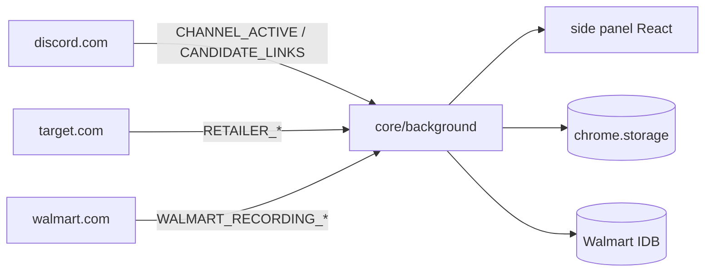

# CookieScripts — Agent Guide

Chrome MV3 extension: auto-opens allowlisted product links from Discord web channels. No Discord user token.

**Docs:** [README.md](./README.md) (install/update) · [AGENTS.md](./AGENTS.md) (this file) · [docs/archive/BUILD.md](./docs/archive/BUILD.md) (archived spec)

## Start here

1. Types: `@ext/core/types/index.ts` for extension + UI-core; domain UI may deep-import own lib only
2. Domain code: `extension/domains/{discord,target,walmart}/`
3. Shared core: `extension/core/{background,lib,types}/`
4. Side panel UI: `ui/popup/core/` + `ui/popup/domains/{discord,target,walmart}/`

**Naming:** folders/docs use **target**; storage/messages keep **retailer** (`RETAILER_*`, `retailer_*`).

## Task routing

| If you are changing… | Read first | Then edit |
|---|---|---|
| Discord link detection / allowlists | `extension/core/lib/process-links.ts`, `extension/domains/discord/content/session.ts` | `extension/domains/discord/background/handlers.ts` |
| Side panel UI / settings | `ui/popup/core/sidepanel-layout.ts`, `App.tsx` | `ui/popup/domains/*/hooks/*`, `extension/core/background/ui-handlers.ts` |
| Target automation / ATC | `extension/domains/target/docs/TARGET_AUTOMATION.md` | `extension/domains/target/content/session/*`, `extension/domains/target/lib/*` |
| Walmart recording | `extension/domains/walmart/docs/WALMART_RECORDING.md` | `extension/domains/walmart/background/handlers/*`, `extension/domains/walmart/content/*` |
| New runtime message | `extension/core/types/messages.ts` | `extension/core/background/handlers.ts`, `sender-auth.ts`, domain handlers, tests |

Per-domain detail: `extension/domains/*/AGENTS.md`.

## Repository layout

| Path | Role |
|---|---|
| `extension/core/` | Service worker router, shared lib, core types, link pipeline |
| `extension/domains/discord/` | Discord content + handlers |
| `extension/domains/target/` | Target automation (content, lib, background, docs, scripts) |
| `extension/domains/walmart/` | Walmart research recorder (content, lib, IDB, background) |
| `ui/sidepanel/` | Production entry → `ui/popup/core/App.tsx` |
| `ui/popup/core/` | App shell, layout, global hooks |
| `ui/popup/domains/*/` | Domain-specific side panel components/hooks |
| `tests/{core,discord,target,walmart,fixtures}/` | Vitest (mirrors domain layout) |
| `public/injected/` | Page-context probes (cart, Walmart research) |

## Import rules

| Consumer | Import from |
|---|---|
| Production types (`extension/**`, `ui/popup/core/**`, `ui/shared/**`) | `@ext/core/types/index.ts` only |
| Core / UI-core needing domain **lib** | `@ext/domains/{target,walmart}/lib/index.ts` barrel |
| UI domain hooks/components (`ui/popup/domains/{target,walmart}/**`) | Own-domain lib deep-import OK; types via `@ext/core/types/index.ts` |
| Core needing domain **background** | Deep `@ext/domains/*/background/**` |
| Domain code | `@ext/core/**` + own `@ext/domains/{self}/**` only |
| Tests | Deep imports OK |

Enforced by `eslint.config.js` for lib barrels and domain isolation (`npm run lint`).

## Architecture (brief)



Content scripts **never** open tabs — the service worker does.

## Dev & test

```bash
npm install
npm run dev          # CRXJS HMR
npm run build        # tsc -b && vite build → dist/
npm test             # all tests
npm run test:core    # tests/core
npm run test:discord # tests/discord
npm run test:target  # tests/target
npm run test:walmart # tests/walmart
npm run lint         # import boundary rules
```

After service-worker or manifest changes: reload on `chrome://extensions`, refresh Discord + Target + Walmart tabs.

## Critical invariants

1. **Bootstrap quiet period** — Discord seeds message IDs on attach; without it, historical links open on load.
2. **Empty allowlist** — observe only; `process-links` no-ops on `[]`.
3. **Sender auth** — never bypass `extension/core/background/sender-auth.ts`.
4. **Retailer job mutex** — one Target automation job at a time (`tryAcquireRetailerJob`).
5. **Backend ATC** — cart API runs in page context via injected probe, not content script.
6. **No new permissions** — never add `cookies`, `webRequest`, or `<all_urls>`.
7. **Discord selectors** — patch `extension/domains/discord/content/selectors.ts` only; bump `SELECTOR_VERSION`.
8. **Domain isolation** — domains must not import each other.

## CI & release

`.github/workflows/ci.yml` and `release.yml`: `npm ci` → `npm test` → `npm run lint` → `npm run build`.
