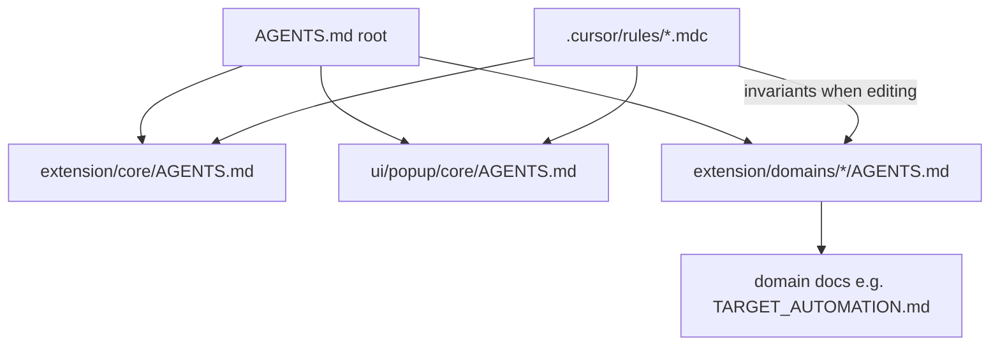
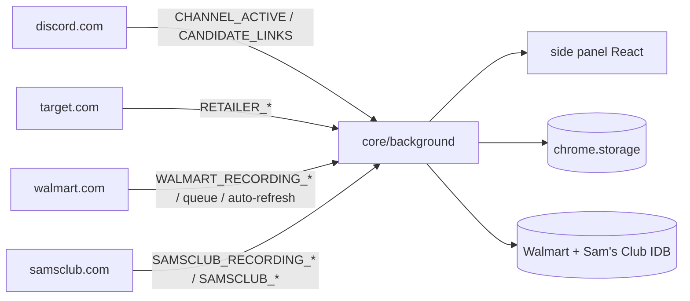

# CookieScripts — Agent Guide

Chrome MV3 extension with four capabilities:

1. **Discord watch** — scans channel tabs for product links; opens allowlisted domains in new windows or background tabs per global setting (no Discord user token).
2. **Target automation** — optional add-to-cart, hard refresh, restock wait, and auto-checkout on `target.com`.
3. **Walmart research** — manual drop-day recorder with IndexedDB persistence and ZIP export; optional hard-refresh auto-refresh and queue helpers (pass alert, tab consolidation, throttle refresh). No auto-checkout.
4. **Sam's Club** — manual drop-day recorder (IDB + ZIP export) and manual-start automation (ATC, hard refresh, checkout) on `samsclub.com`. No Discord link opening.

**Docs:** [README.md](./README.md) (install/update) · [AGENTS.md](./AGENTS.md) (this file) · [docs/archive/BUILD.md](./docs/archive/BUILD.md) (archived spec)

## Start here

1. Types: `@ext/core/types/index.ts` for extension + UI-core; domain UI may deep-import own lib only
2. Core service worker: [extension/core/AGENTS.md](extension/core/AGENTS.md)
3. Domain code: [discord](extension/domains/discord/AGENTS.md) · [target](extension/domains/target/AGENTS.md) · [walmart](extension/domains/walmart/AGENTS.md) · [samsclub](extension/domains/samsclub/AGENTS.md) under `extension/domains/`
4. Side panel UI: [ui/popup/core/AGENTS.md](ui/popup/core/AGENTS.md) + `ui/popup/domains/{discord,target,walmart,samsclub}/`

## Agent workflow

1. Match your task to **Task routing** below and open the linked layer-specific `AGENTS.md`.
2. Put pure logic in `extension/core/lib/*` or domain `lib/*` (Vitest); keep `chrome.*` in background/content layers.
3. New runtime messages: follow [extension/core/AGENTS.md](extension/core/AGENTS.md) § Messages and `.cursor/rules/runtime-messages.mdc`.
4. After service-worker or manifest edits: reload extension on `chrome://extensions`, then refresh Discord, Target, Walmart, and Sam's Club tabs.
5. After implementing a plan or feature: run `npm test`, `npm run lint`, and `npm run build` (build catches TypeScript/Vite errors tests may miss).
6. Before committing code: same verification as step 5. Documentation-only commits on `main`: include `[skip ci]` in the commit message to skip the release workflow (CI still runs).

**Naming:** folders/docs use **target**; storage/messages keep **retailer** (`RETAILER_*`, `retailer_*`).

**UI naming:** Chrome loads the side panel from `ui/sidepanel/` (`manifest.json` → `side_panel.default_path`). The React app lives under `ui/popup/` (historical folder name). `ui/popup/index.html` is a local Vite preview entry only — not shipped in the extension.

## Documentation layers



| Layer | Purpose | Update when |
|---|---|---|
| Root `AGENTS.md` | Global routing, invariants, import rules | Architecture or task-routing changes |
| `extension/core/AGENTS.md` | Service worker, link pipeline, types, storage | New core module or message routing change |
| `ui/popup/core/AGENTS.md` | Side panel shell, section visibility, status contract | New global UI section or status field |
| Domain `AGENTS.md` | File map, messages, domain invariants | Folder restructure, new handler module |
| `.cursor/rules/*.mdc` | Non-negotiable gotchas (auto-injected); includes `runtime-messages.mdc` for message changes | Invariant changes only |
| `extension/domains/{target,walmart,samsclub}/docs/*.md` | Behavioral spec / research | Selector or flow research updates |

**Never in AGENTS.md:** sprint status, TODOs, duplicated selector tables, payload field docs (use `messages.ts`).

**Messages triad:** `messages.ts` = what exists; `.cursor/rules/runtime-messages.mdc` = how to add; layer `AGENTS.md` = where to work + invariants (never enumerate payloads).

## Task routing

| If you are changing… | Read first | Then edit |
|---|---|---|
| Service worker / link pipeline / storage | [extension/core/AGENTS.md](extension/core/AGENTS.md) | `extension/core/background/*`, `extension/core/lib/*` |
| Side panel shell / section visibility | [ui/popup/core/AGENTS.md](ui/popup/core/AGENTS.md) | `ui/popup/core/*`, `extension/core/background/ui-handlers.ts` |
| Discord link detection / allowlists | [extension/domains/discord/AGENTS.md](extension/domains/discord/AGENTS.md) | `extension/domains/discord/background/handlers.ts`, `content/*` |
| Side panel domain settings | Extension domain `AGENTS.md` § UI + `ui/popup/core/AGENTS.md` | `ui/popup/domains/*/hooks/*`, `components/*` — seed hooks from `ExtensionStatus`; see `ui/popup/core/AGENTS.md` § Panel hook seeding |
| Target automation / ATC | [extension/domains/target/AGENTS.md](extension/domains/target/AGENTS.md) | `extension/domains/target/content/session/*`, `lib/*` |
| Walmart recording / auto-refresh / queue | [extension/domains/walmart/AGENTS.md](extension/domains/walmart/AGENTS.md) | `extension/domains/walmart/background/handlers/*`, `content/*`, `lib/queue-*` |
| Sam's Club recording / manual automation | [extension/domains/samsclub/AGENTS.md](extension/domains/samsclub/AGENTS.md) | `extension/domains/samsclub/background/handlers/*`, `content/*`, `lib/*` |
| New runtime message | [extension/core/AGENTS.md](extension/core/AGENTS.md) | `extension/core/types/messages.ts`, `extension/core/background/handlers.ts`, domain handlers, tests |
| Manifest / permissions | This file § Critical invariants | `manifest.json` (no new sensitive permissions) |

## Repository layout

| Path | Role |
|---|---|
| `extension/core/` | Service worker router, shared lib, core types, link pipeline |
| `extension/domains/discord/` | Discord content + handlers |
| `extension/domains/target/` | Target automation (content, lib, background, docs, scripts) |
| `extension/domains/walmart/` | Walmart research recorder (content, lib, IDB, background) |
| `extension/domains/samsclub/` | Sam's Club recorder + manual automation (content, lib, IDB, background) |
| `ui/sidepanel/` | Production Chrome entry: `index.html` → `main.tsx` → `ui/popup/core/App.tsx` |
| `ui/popup/core/` | App shell, layout, global hooks |
| `ui/popup/domains/*/` | Domain-specific side panel components/hooks |
| `ui/shared/` | Cross-domain React components + Tailwind entry (`@shared`) |
| `tests/{core,discord,target,walmart,samsclub,fixtures}/` | Vitest (mirrors domain layout; `fixtures/` = handler setup + Target checkout HTML) |
| `public/injected/` | Page-context probes (source); built as `injected/*.js` in `dist/` |
| `public/sounds/` | Extension assets (e.g. Walmart queue-pass alert) |
| `icons/` | Extension toolbar / store icons |
| `manifest.json` | MV3 manifest (content scripts, permissions, side panel path) |
| `vite.config.ts` | CRXJS + React build; path aliases `@ext`, `@shared` |

## Path aliases

| Alias | Resolves to | Used by |
|---|---|---|
| `@ext/*` | `extension/*` | Extension + UI imports |
| `@shared/*` | `ui/shared/*` | Side panel shared components/styles |

## Import rules

| Consumer | Import from |
|---|---|
| Production types (`extension/**`, `ui/popup/core/**`, `ui/shared/**`) | `@ext/core/types/index.ts` only |
| Core / UI-core needing domain **lib** | `@ext/domains/{target,walmart,samsclub}/lib/index.ts` barrel |
| UI domain hooks/components (`ui/popup/domains/{discord,target,walmart,samsclub}/**`) | Own-domain lib deep-import OK (Discord has no `lib/`); types via `@ext/core/types/index.ts` |
| Core needing domain **background** | Deep `@ext/domains/*/background/**` |
| Domain code | `@ext/core/**` + own `@ext/domains/{self}/**` only |
| Tests | Deep imports OK |

**ESLint** (`eslint.config.js`) enforces domain isolation and Target/Walmart/Sam's Club lib barrels. The `@ext/core/types/index.ts` rule is convention, not lint-enforced. Core may deep-import `@ext/domains/target/lib/{host,channel-config,quantity-limit}.ts` for chunk-safe imports (see `eslint.config.js`).

## Architecture (brief)



Content scripts **never** open tabs — the service worker does.

Pure logic belongs in `extension/core/lib/*` or domain `lib/*` (Vitest); keep `chrome.*` in background/content layers.

## Manifest & permissions

Current `manifest.json` (do not add `cookies`, `webRequest`, or `<all_urls>`):

| Kind | Values |
|---|---|
| `permissions` | `storage`, `tabs`, `windows`, `sidePanel`, `downloads` |
| `host_permissions` | `discord.com`, `target.com` (+ `www`), `carts.target.com`, `walmart.com` (+ `www`), `samsclub.com` (+ `www`), `api.github.com` |
| `side_panel.default_path` | `ui/sidepanel/index.html` |
| `web_accessible_resources` | `injected/cart-probe.js`, `injected/walmart-research-probe.js`, `injected/samsclub-research-probe.js`, `injected/samsclub-cart-probe.js`, `injected/queue-probe.js`, `sounds/queue-pass.mp3` (Target, Walmart, and Sam's Club origins) |

Content scripts: Discord (`document_idle`); Target early (`document_start`) + main (`document_end`); Walmart early (`document_start`, queue probe) + main (`document_idle`); Sam's Club early (`document_start`) + main (`document_idle`).

## Dev & test

**Requires Node.js 20+** (`package.json` `engines`).

```bash
npm install
npm run dev          # CRXJS HMR — load unpacked from dist/ after first build
npm run build        # tsc -b && vite build → dist/
npm run package      # build + zip cookiescripts-{version}.zip
npm test             # all Vitest suites
npm run test:watch   # Vitest watch mode
npm run test:core    # tests/core
npm run test:discord # tests/discord
npm run test:target  # tests/target
npm run test:walmart # tests/walmart
npm run test:samsclub # tests/samsclub
npm run lint         # import boundary rules + TypeScript ESLint
```

**Reload checklist** after service-worker or manifest changes:

1. Reload extension on `chrome://extensions`
2. Refresh open Discord, Target, Walmart, and Sam's Club tabs

**Before committing:** run `npm test`, `npm run lint`, and `npm run build`.

## Critical invariants

1. **Bootstrap quiet period** — Discord seeds message IDs on attach; without it, historical links open on load.
2. **Empty allowlist** — observe only; `process-links` no-ops on `[]`.
3. **Sender auth** — never bypass `extension/core/background/sender-auth.ts`.
4. **Target repeat opens** — Discord-initiated Target `/p/` links open up to `retailer_link_open_count` times per unique URL per message (default 1); no per-channel Auto ATC concurrency cap.
5. **Backend ATC** — cart API runs in page context via `public/injected/cart-probe.js`, not content script.
6. **Sam's Club backend ATC** — cart API runs in page context via `public/injected/samsclub-cart-probe.js`, not content script.
7. **No new permissions** — never add `cookies`, `webRequest`, or `<all_urls>`.
8. **Discord selectors** — patch `extension/domains/discord/content/selectors.ts` only; bump `SELECTOR_VERSION`.
9. **Domain isolation** — domains must not import each other.

## CI & release

- **CI** (`.github/workflows/ci.yml`): on push/PR to `main` — `npm ci` → `npm test` → `npm run lint` → `npm run build`.
- **Release** (`.github/workflows/release.yml`): on push to `main`, bumps patch version and publishes GitHub release zip — **skipped** when commit message contains `[skip ci]`. CI still runs on `[skip ci]` pushes.

Use `[skip ci]` for documentation-only commits that should not trigger a release.
