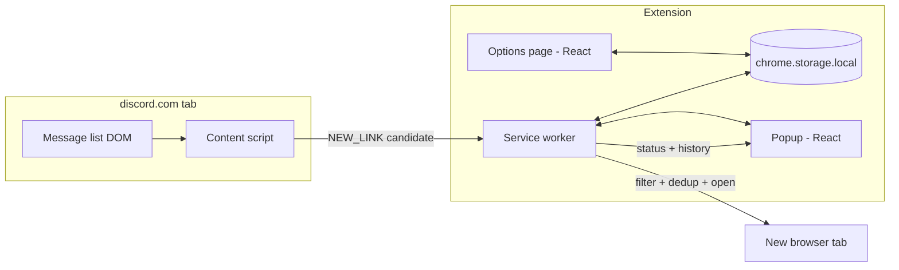

> Forked from autoopen/docs/CHROME_EXTENSION_BUILD.md @ `5d7d38faeef03a67356f152a9f3898e30bb07f99`.
> Product spec changes upstream first; re-copy or cherry-pick here.

# CookieScripts — build spec

## Identity

| Layer | Name |
|-------|------|
| GitHub repo | [CookieScripts](https://github.com/Quarks-1/CookieScripts) |
| Extension name (manifest, UI) | CookieScripts |
| Upstream desktop app | [Quarks-1/autoopen](https://github.com/Quarks-1/autoopen) |

Planning document for a Chrome extension that auto-opens allowlisted links from Discord
web messages. No Discord user token. The user keeps [discord.com/app](https://discord.com/app)
open in a browser tab; a content script watches the page and opens matching links.

**Upstream reference:** [Quarks-1/autoopen](https://github.com/Quarks-1/autoopen) — desktop
app (Tauri + Python Gateway listener). This extension reuses product concepts and portable
logic from that repo but does **not** share its runtime architecture.

**CRXJS manifest paths:** In this repo, `manifest.json` references **source entrypoints**
(`.ts`, `.html`) relative to the Vite project root. `@crxjs/vite-plugin` rewrites them in
`dist/` during build. Do not point the dev manifest at post-build `dist/` paths from the
starter snippet below.

---

## Product summary

| | Desktop app (autoopen) | Chrome extension (this repo) |
|---|---|---|
| Auth | Discord user token (ToS risk) | User's normal Discord web session |
| Listener | Python `discord.py-self` Gateway | DOM content script on `discord.com` |
| Always-on | Yes (background sidecar) | No — requires open Discord tab(s) |
| Open link | `webbrowser.open()` | `chrome.tabs.create()` |
| Settings | Keychain / `.env` | `chrome.storage.local` |
| Multi-channel | All channels simultaneously | One channel per open Discord tab |

**Warning (carry over from upstream):** Automating link-opening from Discord messages may
still conflict with Discord's Terms of Service. This approach avoids storing a user token,
which reduces risk but does not eliminate policy concerns.

---

## Goals

### MVP (v0.1)

- [ ] Content script runs on `https://discord.com/channels/*`
- [ ] Detect current `channel_id` from URL
- [ ] If channel is in watch list, observe new messages and extract URLs
- [ ] Filter URLs by per-channel `allowed_domains`
- [ ] Dedup and open matches in a new tab
- [ ] Options page: configure channel targets (channel ID + domain pills)
- [ ] Popup: connection status (active channel, match count, last opened link)
- [ ] History of opened / skipped-duplicate links (last 200)

### v0.2+

- [ ] Multi-tab: multiple Discord channel tabs monitored in parallel
- [ ] Badge on extension icon when watching an active target channel
- [ ] Selector resilience / fallback extraction strategies
- [ ] Optional: intercept Discord REST responses in-page (session piggyback) for reliability
- [ ] Vitest unit tests for link parsing and validation (port upstream tests)
- [ ] Chrome Web Store publish

### Non-goals (for now)

- Discord bot / official API integration
- Storing or prompting for a Discord user token
- Native messaging host / Python sidecar
- Firefox / Safari ports
- Feature parity with desktop always-on listener

---

## Architecture



### Message flow

1. User navigates to `discord.com/channels/<guild>/<channel_id>` (logged in normally).
2. Content script reads `channel_id` from `location.pathname`.
3. Content script asks background: "is this channel watched?" → background reads storage.
4. If watched, attach `MutationObserver` to the message list container.
5. On new message nodes, extract text + `href`s from body and embed areas.
6. Content script runs link extraction locally (or sends raw text to background).
7. Background applies domain filter + dedup (authoritative), calls `chrome.tabs.create()`.
8. Background appends to in-memory history + persists recent history to storage.

**Why background opens tabs:** MV3 content scripts should delegate privileged actions
(`chrome.tabs.create`) to the service worker for consistency and easier auditing.

---

## Repo layout (target)

```
autoopen-chrome/
├── BUILD.md                 # this file (copy from autoopen docs/CHROME_EXTENSION_BUILD.md)
├── README.md
├── manifest.json
├── package.json
├── tsconfig.json
├── vite.config.ts           # build options + popup as separate entries
├── extension/
│   ├── background/
│   │   └── service-worker.ts
│   ├── content/
│   │   ├── discord.ts       # entry — URL match, observer setup
│   │   ├── selectors.ts     # DOM selectors (versioned, easy to patch)
│   │   └── extract.ts       # pull text/hrefs from message nodes
│   ├── lib/
│   │   ├── links.ts         # ported from autoopen backend/links.py
│   │   ├── channels.ts      # parse channel_id from Discord URL
│   │   ├── validate.ts      # ported from autoopen ui validateChannelTargets
│   │   ├── storage.ts       # chrome.storage wrapper
│   │   ├── messages.ts      # typed runtime message protocol
│   │   └── constants.ts
│   └── types/
│       └── index.ts
├── ui/
│   ├── popup/               # React — status + recent history
│   ├── options/             # React — watch targets editor
│   └── shared/              # DomainPills, components ported from autoopen
├── public/
│   └── icons/               # 16, 48, 128
└── tests/
    ├── links.test.ts
    └── validate.test.ts
```

Suggested package name: `autoopen-chrome` or `autoopen-extension`.

---

## manifest.json (starter)

```json
{
  "manifest_version": 3,
  "name": "autoopen",
  "version": "0.1.0",
  "description": "Auto-open allowlisted links from Discord web channels you watch.",
  "permissions": ["storage", "tabs"],
  "host_permissions": ["https://discord.com/*"],
  "background": {
    "service_worker": "background/service-worker.js",
    "type": "module"
  },
  "content_scripts": [
    {
      "matches": ["https://discord.com/channels/*"],
      "js": ["content/discord.js"],
      "run_at": "document_idle"
    }
  ],
  "action": {
    "default_popup": "popup/index.html",
    "default_icon": {
      "16": "icons/icon16.png",
      "48": "icons/icon48.png",
      "128": "icons/icon128.png"
    }
  },
  "options_ui": {
    "page": "options/index.html",
    "open_in_tab": true
  },
  "icons": {
    "16": "icons/icon16.png",
    "48": "icons/icon48.png",
    "128": "icons/icon128.png"
  }
}
```

**Permissions rationale (for CWS review):**

- `storage` — save watch targets and history
- `tabs` — open matched product links in new tabs
- `host_permissions: discord.com` — content script injection only; no cross-site access

Do **not** request `cookies`, `webRequest`, or broad `<all_urls>` unless a later phase
explicitly needs them.

---

## Data model

### Settings (`chrome.storage.local`)

```ts
interface ChannelTarget {
  channel_id: string;       // numeric Discord snowflake as string
  allowed_domains: string[]; // lowercase, no protocol, e.g. "walmart.com"
}

interface ExtensionSettings {
  channel_targets: ChannelTarget[];
  enabled: boolean;           // global kill switch (default true)
}

interface HistoryItem {
  kind: "opened" | "duplicate";
  url: string;
  author: string;             // best-effort from DOM; may be "unknown"
  channel_id: string;
  timestamp: string;          // ISO 8601
}

interface PersistedState {
  settings: ExtensionSettings;
  history: HistoryItem[];     // cap at 200 (match autoopen backend/service.py)
}
```

No `discord_token`. No `has_token` field.

### Runtime message protocol

```ts
// content → background
type ContentToBackground =
  | { type: "CHANNEL_ACTIVE"; channel_id: string }
  | { type: "CHANNEL_INACTIVE" }
  | { type: "CANDIDATE_LINKS"; channel_id: string; urls: string[]; author?: string };

// background → content
type BackgroundToContent =
  | { type: "WATCH_CONFIG"; channel_id: string | null; allowed_domains: string[] }
  | { type: "PING" };

// popup/options ↔ background
type UiToBackground =
  | { type: "GET_STATUS" }
  | { type: "GET_SETTINGS" }
  | { type: "SAVE_SETTINGS"; settings: ExtensionSettings }
  | { type: "GET_HISTORY" }
  | { type: "CLEAR_HISTORY" };
```

---

## Logic to port from autoopen

### 1. Link parsing — **port verbatim to TypeScript**

**Source:** `backend/links.py` in [autoopen](https://github.com/Quarks-1/autoopen)

| Function | Purpose |
|----------|---------|
| `extract_urls(text)` | Regex `https?://...`, strip trailing punctuation |
| `filter_urls_by_domains(urls, allowed)` | Host match with `www.` strip + subdomain suffix |
| `normalize_url_for_dedup(url)` | Unwrap `goto.walmart.com?u=...`, normalize host/path |
| `unwrap_affiliate_url(url)` | Walmart affiliate unwrap |
| `host_matches(host, allowed)` | `example.com` matches `www.example.com`, `a.example.com` |

**Tests to port:** `backend/tests/test_links.py` → `tests/links.test.ts`

Dedup limit: **500** recent normalized URLs (see `RECENT_URL_LIMIT` in
`backend/discord_client.py`).

### 2. Channel target validation

**Source:** `ui/src/lib/validateChannelTargets.ts` in autoopen

Rules (keep aligned with upstream):

- At least one channel target
- `channel_id` must be numeric digits, positive integer (`BigInt` check)
- No duplicate channel IDs
- Each channel needs ≥1 allowed domain

**Source for domain normalization in UI:** `ui/src/components/DomainPills.tsx`
(`normalizeDomain`, `pillsFromDomains`, `enabledDomains`)

**Draft ↔ target conversion:** `ui/src/lib/channelTargetDrafts.ts`

### 3. UI components to adapt (not copy blindly)

| autoopen file | Extension use |
|---------------|---------------|
| `ui/src/components/WatchTargetsForm.tsx` | Options page — remove token/disable-when-running logic |
| `ui/src/components/DomainPills.tsx` | Reuse as-is (drop Tauri-specific styling tokens if needed) |
| `ui/src/components/LinkHistory.tsx` | Popup or options — add `channel_id` column |
| `ui/src/components/StatusBadge.tsx` | Popup — "Watching #channel" / "Not a watched channel" |
| `ui/src/hooks/useSettingsEditor.ts` | Adapt to `chrome.storage` instead of API/Tauri invoke |

**Do not port:**

| autoopen file | Reason |
|---------------|--------|
| `backend/discord_client.py` | Gateway listener — replaced by content script |
| `backend/service.py` | Python lifecycle |
| `backend/api.py` | Localhost FastAPI |
| `src-tauri/**` | Desktop shell |
| `ui/src/hooks/useLiveApi.ts` | Localhost polling + WebSocket |
| `ui/src/lib/settings.ts` | Tauri invoke / PUT /settings |
| `ui/src/components/CredentialsForm.tsx` | No token |

### 4. Icons

Copy or regenerate from `assets/icon-source.png` or `ui/src/assets/icon.png` in autoopen.
Export 16×16, 48×48, 128×128 PNG for manifest.

---

## Content script design

### Channel detection

Discord web channel URLs:

```
https://discord.com/channels/<guild_id>/<channel_id>
https://discord.com/channels/@me/<channel_id>          # DMs
```

```ts
function parseChannelId(pathname: string): string | null {
  const parts = pathname.split("/").filter(Boolean);
  // ["channels", guildOrMe, channelId, ...]
  if (parts[0] !== "channels" || !parts[2]) return null;
  if (!/^\d+$/.test(parts[2])) return null; // skip @me thread-only paths without numeric id
  return parts[2];
}
```

Re-run detection on `popstate` and SPA navigations (Discord is client-routed):

```ts
// Hook history.pushState / replaceState OR observe location with setInterval fallback
window.addEventListener("popstate", onRouteChange);
```

### DOM observation strategy

**Primary (MVP):** `MutationObserver` on the scrollable message list.

1. On channel activation, locate message list root (see selectors below).
2. Observe `childList` + `subtree`.
3. For added nodes, check if they represent a message (heuristic).
4. Skip messages authored by the current user if detectable (match upstream:
   `backend/discord_client.py` skips `message.author == self.user`).
5. Extract content and send `CANDIDATE_LINKS` to background.

**Selector policy:** Keep all Discord-specific selectors in `extension/content/selectors.ts`
with a `SELECTOR_VERSION` constant and a comment with the date Discord layout was verified.
Expect to update this file without touching core logic.

**Starter selectors (verify on load — these WILL break):**

```ts
// selectors.ts — treat as hints, not contracts
export const SELECTOR_VERSION = "2026-06-27";

export const MESSAGE_LIST = '[class*="messagesWrapper"] [class*="scroller"]';
export const MESSAGE_ARTICLE = '[class*="message"][role="article"], [id^="chat-messages-"] [class*="message"]';
export const MESSAGE_CONTENT = '[class*="messageContent"]';
export const EMBED = '[class*="embed"]';
export const AUTHOR = '[class*="username"]';
```

**Fallback extraction:** For any candidate message subtree, collect:

- `element.textContent`
- all `a[href]` values inside the subtree

Pass combined text to `extract_urls()`.

### Embed / rich content parity

Upstream scans message body **and** embed fields (`backend/discord_client.py` lines 72–82).
The content script must not only read the main message text span — walk embed containers
for links and visible text.

### Duplicate handling from virtual scroll

Discord virtualizes the message list. Scrolling back may re-insert old messages → observer
fires again. Background dedup via `normalize_url_for_dedup` handles this (same as desktop).

---

## Service worker design

Responsibilities:

1. Load / cache settings from `chrome.storage.local`
2. Respond to `CHANNEL_ACTIVE` — tell content script if channel is watched + domains
3. On `CANDIDATE_LINKS` — filter, dedup, `chrome.tabs.create({ url, active: false })`
   - Use `active: false` so user stays on Discord (product decision — document in README)
4. Maintain `recentUrlSet` (cap 500) and `history` (cap 200) in memory; persist history periodically
5. Broadcast status updates to popup when open

**MV3 lifetime:** Service worker may sleep. Content script does the continuous observation;
worker only wakes on messages. No persistent WebSocket needed.

```ts
// Opening tabs
await chrome.tabs.create({ url, active: false });
```

---

## UI pages

### Options (full tab)

- Watch targets editor (ported `WatchTargetsForm` + `DomainPills`)
- Global enable/disable toggle
- Clear history button
- Help text: how to get channel ID (copy from upstream `README.md` — Developer Mode →
  right-click channel → Copy Channel ID)
- Note: "Keep a Discord tab open on each channel you want monitored"

### Popup (small)

- Current tab's channel ID and whether it's watched
- Listener state: Active / Not watching / Discord tab not detected
- Last 5–10 history items
- Link to options page

**Tech stack:** React 19 + TypeScript + Vite + Tailwind 4 — match autoopen `ui/package.json`
for consistency. Build outputs into `dist/`; manifest references `dist/` paths.

---

## Build tooling notes

- Use `@crxjs/vite-plugin` or `vite-plugin-web-extension` for MV3 bundling with HMR
- Separate entry points: `service-worker`, `content/discord`, `popup`, `options`
- `npm run build` → load unpacked from `dist/` in `chrome://extensions`
- `npm test` → Vitest for `lib/links.ts` and `lib/validate.ts`

Environment variables: none required for MVP.

---

## Testing strategy

### Unit tests (required for MVP)

| Test file | Based on |
|-----------|----------|
| `tests/links.test.ts` | `backend/tests/test_links.py` |
| `tests/validate.test.ts` | `ui/src/lib/validateChannelTargets.test.ts` |

### Manual test checklist

1. Install unpacked extension
2. Configure one channel + `walmart.com` in options
3. Open `discord.com/channels/.../<that_channel_id>`
4. Post or receive a Walmart link in that channel
5. Verify new tab opens with correct URL
6. Post same link again → duplicate in history, no second tab
7. Post link on non-allowed domain → ignored
8. Navigate to unwatched channel → popup shows "Not watching"
9. Close Discord tab → popup shows inactive
10. Test `goto.walmart.com?u=...` unwrap opens final Walmart URL

---

## Known limitations (document in README)

1. **Discord tab must be open** — no background listening when browser is closed or tab
   is on a different site.
2. **One channel per tab** — multi-channel requires multiple Discord tabs on different
   channels (v0.2 can improve UX with badges per tab).
3. **DOM fragility** — Discord UI updates can break selectors; fix via `selectors.ts` patches.
4. **Slight delay** — links open after DOM render, not Gateway push; typically sub-second.
5. **Author detection** — best-effort from DOM; may show "unknown" unlike Gateway username.
6. **No hot-reload of settings in content script** — listen to
   `chrome.storage.onChanged` and re-fetch watch config when options save.

---

## Future: session piggyback (v0.3 exploratory)

If DOM scraping proves too brittle, an alternative **still without a stored token**:

- In content script page context, hook `fetch` / `XMLHttpRequest` responses from
  `discord.com/api/v*/channels/<id>/messages`
- Parse JSON message payloads (stable schema) instead of DOM
- Uses the user's existing session cookies automatically (`credentials: 'include'`)
- Higher engineering complexity; higher breakage risk when Discord changes API version
- May require additional CWS justification

Keep MVP on DOM-only; document this as escalation path.

---

## Distribution

| Method | Requirements |
|--------|--------------|
| Load unpacked (dev/personal) | None |
| Chrome Web Store | $5 one-time [Chrome Web Store developer account](https://chrome.google.com/webstore/devconsole); Google signs published package |

**No macOS code signing** (that applies only to the Tauri desktop app in autoopen).

Privacy policy needed for CWS if you store history locally (even though data stays on device).

---

## Relationship to autoopen desktop app

| Keep using desktop app when… | Use Chrome extension when… |
|------------------------------|----------------------------|
| You need 24/7 monitoring | You already keep Discord web open |
| Multiple channels, no extra tabs | Single/few channels, tab open anyway |
| Fastest possible link open | Slightly delayed open is OK |
| macOS native install is fine | You want zero install / cross-platform |

Both can coexist; settings formats (`channel_targets`) are intentionally aligned for
possible future import/export.

---

## MVP task breakdown

### Phase 1 — Scaffold (day 1–2)

- [ ] Init repo, Vite + React + TS + Tailwind + CRX plugin
- [ ] `manifest.json`, icons, empty service worker + content script
- [ ] `chrome.storage` wrapper with typed settings

### Phase 2 — Core logic (day 2–4)

- [ ] Port `links.ts` + unit tests from autoopen
- [ ] Port `validate.ts` + unit tests
- [ ] Service worker: dedup, filter, open tab, history

### Phase 3 — Content script (day 4–7)

- [ ] Channel ID from URL + SPA navigation hooks
- [ ] MutationObserver + message extraction
- [ ] Runtime messaging to background
- [ ] `storage.onChanged` → update watch config

### Phase 4 — UI (day 7–10)

- [ ] Options page with watch targets editor
- [ ] Popup with status + history
- [ ] Port `DomainPills`, adapt `WatchTargetsForm`

### Phase 5 — Polish (day 10–14)

- [ ] Manual test checklist
- [ ] README with limitations and setup
- [ ] Selector verification on live Discord
- [ ] Optional: GitHub Actions `npm test` + `npm run build`

---

## Upstream file reference index

| Topic | autoopen path |
|-------|---------------|
| Link extraction | `backend/links.py` |
| Link tests | `backend/tests/test_links.py` |
| Channel validation | `ui/src/lib/validateChannelTargets.ts` |
| Domain pills UI | `ui/src/components/DomainPills.tsx` |
| Watch targets form | `ui/src/components/WatchTargetsForm.tsx` |
| Settings editor hook | `ui/src/hooks/useSettingsEditor.ts` |
| Link history UI | `ui/src/components/LinkHistory.tsx` |
| Channel target types | `ui/src/lib/api.ts` (`ChannelTarget`, `HistoryItem`) |
| Dedup / open behavior | `backend/discord_client.py` |
| History limit (200) | `backend/service.py` `HISTORY_LIMIT` |
| Product README / channel ID help | `README.md` |
| Icon source | `assets/icon-source.png` |

---

## Open questions (resolve before coding)

1. **Tab focus:** Open matched links `active: false` (stay on Discord) or `active: true`
   (jump to product)? Desktop app uses `webbrowser.open(url, new=2)` — new tab, background.
   **Recommend:** `active: false` for parity.
2. **Global kill switch:** Include in MVP or rely on disabling extension?
   **Recommend:** include `settings.enabled`.
3. **Extension name:** `autoopen` vs `autoopen-chrome` on CWS?
4. **Repo name / GitHub org:** Same `Quarks-1` org as upstream?

---

*Last updated: 2026-06-27*
