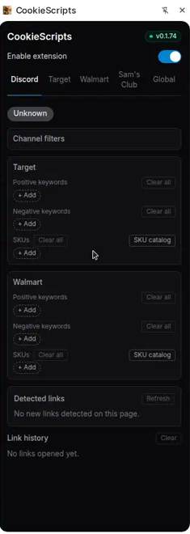
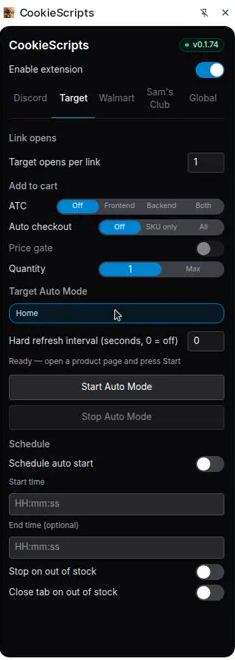
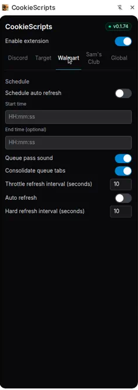
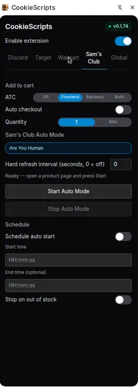
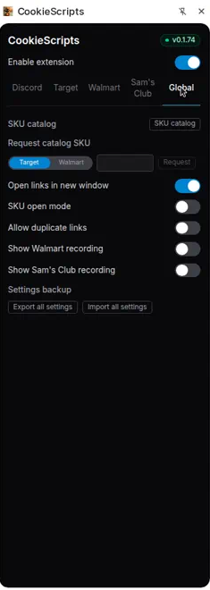
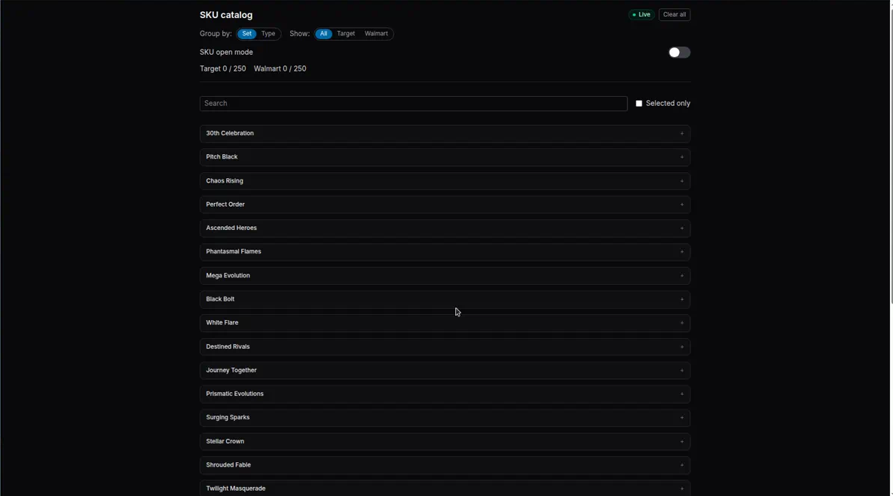

# CookieScripts

Chrome extension with a side panel for Discord link watching, Target automation, Walmart drop-day research, and Sam's Club recording plus manual automation. Global settings include SKU catalog picking, link-open behavior, and settings backup.

See [AGENTS.md](./AGENTS.md) for architecture and where to edit.

**Repo:** [Quarks-1/CookieScripts](https://github.com/Quarks-1/CookieScripts)  
**Upstream desktop app:** [Quarks-1/autoopen](https://github.com/Quarks-1/autoopen)

## Screenshots

Side panel (Chrome **side panel**, not a toolbar popup) and the full-tab SKU catalog options page:

<table>
  <tr>
    <td align="center" valign="top" width="33%">
      <strong>Discord</strong><br/>
      <sub>Per-channel domain allowlists, global Target/Walmart keyword and SKU filters, detected links, and link history.</sub><br/>
      
    </td>
    <td align="center" valign="top" width="33%">
      <strong>Target</strong><br/>
      <sub>Link open count, add-to-cart and checkout modes, quantity, manual auto mode, and schedule.</sub><br/>
      
    </td>
    <td align="center" valign="top" width="33%">
      <strong>Walmart</strong><br/>
      <sub>Schedule, auto-refresh, and queue helpers (recording UI when enabled in Global).</sub><br/>
      
    </td>
  </tr>
  <tr>
    <td align="center" valign="top" width="33%">
      <strong>Sam's Club</strong><br/>
      <sub>Add-to-cart, auto checkout, manual auto mode, schedule, and recording (when enabled in Global).</sub><br/>
      
    </td>
    <td align="center" valign="top" width="33%">
      <strong>Global</strong><br/>
      <sub>SKU catalog launch, catalog SKU requests, link-open and SKU modes, recording visibility toggles, and settings import/export.</sub><br/>
      
    </td>
    <td></td>
  </tr>
  <tr>
    <td colspan="3" align="center" valign="top">
      <strong>SKU catalog</strong><br/>
      <sub>Pokémon TCG picker (grouped by set or type) that syncs Target/Walmart watch SKUs with the Discord tab.</sub><br/>
      
    </td>
  </tr>
</table>

## Prerequisites

- Node.js 20+
- Google Chrome

## Development

```bash
npm install
npm run dev      # Extension HMR (reload on chrome://extensions for service worker changes)
npm run build    # Production build → dist/
npm test         # Vitest unit tests (links, validate, process-links, handlers, content)
```

After changing the service worker or background handlers, reload the extension on `chrome://extensions`.

## Install (from release)

1. Open [GitHub Releases](https://github.com/Quarks-1/CookieScripts/releases)
2. Download `cookiescripts-X.Y.Z.zip` for the latest release
3. Unzip to a permanent folder (`manifest.json` must be at the root of that folder)
4. Open `chrome://extensions` → enable **Developer mode** → **Load unpacked** → select that folder
5. Pin the extension and open the side panel on a Discord channel tab

If you installed from a dev build before releases existed, do this once to enable in-extension update checks (new `api.github.com` permission).

## Update

1. Download the latest `cookiescripts-X.Y.Z.zip` from [Releases](https://github.com/Quarks-1/CookieScripts/releases)
2. Unzip **into the same folder** already loaded in Chrome (replace all files)
3. On `chrome://extensions`, click **Reload** on the existing CookieScripts card — do **not** use **Load unpacked** again (that creates a duplicate extension and resets settings)

The side panel shows an update banner when a newer release is available (checks GitHub each time you open the side panel; unchanged releases reuse a cached ETag).

## Load unpacked (development)

1. Run `npm run build` (or `npm run package` for a local zip)
2. Open `chrome://extensions`
3. Enable **Developer mode**
4. Click **Load unpacked** and select the `dist/` folder
5. Pin the extension and open the side panel on a Discord channel tab

Releases are created automatically on every push to `main` (patch version bump). Contributors should `git pull` after merging to stay in sync with version commits from CI.

## Permissions

| Permission | Why |
|------------|-----|
| `storage` | Save per-channel domain allowlists, link history, dedup keys, and update-check cache locally on your device |
| `tabs` | Open matched product links and the GitHub release page when you choose to download an update |
| `windows` | Open auto-linked product pages in separate windows (default) and Target Auto Mode product links in a focused window |
| `host_permissions: discord.com` | Inject the content script on Discord channel pages to scan messages |
| `host_permissions: target.com` | Inject the retailer content script for Target Auto Mode (add-to-cart automation and manual record mode) |
| `host_permissions: api.github.com` | Check the public GitHub Releases API for newer versions (anonymous GET; no Discord or settings data sent) |
| `host_permissions: raw.githubusercontent.com` | Fetch the live SKU catalog from `main` when you open the catalog page (anonymous GET; cached locally with ETag) |

## Known limitations

- **Thread URLs:** allowlists use the parent channel ID from `/channels/guild/parent/threadId` paths
- **Message edits:** links added by editing an existing message are not detected until v0.2
- **Selector fragility:** Discord UI changes may require updates to `extension/domains/discord/content/selectors.ts`
- **Target Auto Mode:** Automating add-to-cart on target.com may conflict with Target's terms of service; automation uses synthetic keyboard events and may fail on bot-protected pages. Use at your own risk.
- **Masked links:** external URLs in visible message text are preferred over Discord redirect `href`s

## Privacy

- Data stays on your device; no Discord user token is collected or stored
- When the extension is enabled, open Discord channel tabs are scanned for links in new messages (link opening is still gated by your per-channel domain allowlist in the popup)
- `chrome.storage.local` holds per-channel domain allowlists, link history (last 200), recent dedup keys (last 500), cached update-check metadata, and cached SKU catalog data (raw JSON + ETag from `raw.githubusercontent.com`)
- The popup may send an anonymous GET to `api.github.com` to compare your installed version with the latest GitHub release; no Discord messages, settings, or history are transmitted
- The SKU catalog page may send an anonymous GET to `raw.githubusercontent.com` for `catalog.json` on `main`; selections still sync via `watch_skus` in `chrome.storage.local`
- **Request catalog SKU** (Global side panel tab) opens a pre-filled GitHub issue in your browser; see [docs/catalog-sku-request.md](./docs/catalog-sku-request.md)
- Extension packages are distributed via GitHub Releases over HTTPS; trust model is the Quarks-1 org and your browser’s download of the release zip

## Discord Terms of Service

Automating link-opening from Discord messages may conflict with Discord's Terms of Service.
This extension avoids storing a user token, which reduces risk but does not eliminate policy concerns.

## Icons

Toolbar icons are derived from [Quarks-1/autoopen](https://github.com/Quarks-1/autoopen).

## Architecture rules

- The popup messages the service worker for extension logic; it opens the GitHub release page when you download an update
- Service worker validates message `sender` (content vs extension-page paths)
- Content script uses `textContent` (not `innerHTML`) for scraped Discord text
- Matched links open in a new unfocused window by default (toggleable in the side panel); background-tab mode uses `active: false` so you stay on Discord
