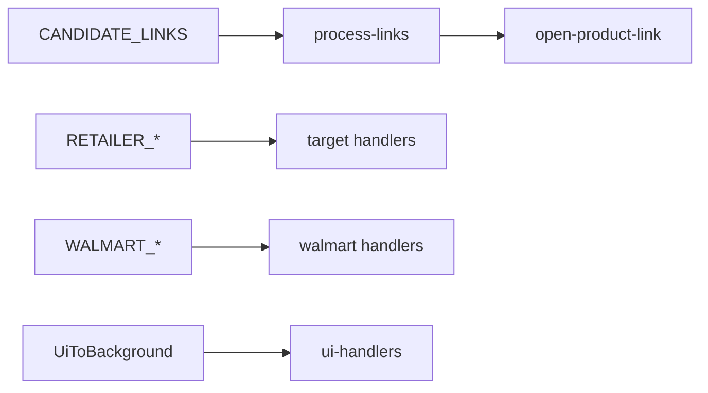

# Core extension

Chrome MV3 service worker hub — message router, link opening pipeline, shared storage/status, sender auth.

## Key files

| Area | Path |
|---|---|
| Entry | `background/service-worker.ts` |
| Message router | `background/handlers.ts` → domain handlers |
| Sender auth | `background/sender-auth.ts` |
| UI messages | `background/ui-handlers.ts` |
| Status contract | `background/status.ts`, `types/status.ts` |
| Open tabs | `background/open-product-link.ts` |
| Runtime dedup/state | `background/runtime-state.ts` |
| Link pipeline | `lib/process-links.ts`, `lib/links.ts`, `lib/validate.ts` |
| Channel allowlists | `lib/channel-targets.ts`, `lib/storage.ts` |
| Types | `types/messages.ts`, `types/core.ts`, `types/index.ts` |

## Data flow

## Messages

Unions in `types/messages.ts`: `ContentToBackground`, `RetailerToBackground`, `WalmartToBackground`, `BackgroundToContent`, `UiToBackground`.

When adding or changing a message:

1. Extend unions in `types/messages.ts` (or domain types re-exported from `index.ts`).
2. Add type guard in `background/handlers.ts` (`is*ContentMessage` / `isUiMessage`).
3. Add handler in matching domain `background/handlers.ts`.
4. Update `background/sender-auth.ts` only when adding a new content-script origin domain.
5. Add/adjust tests in `tests/core/handlers-*.test.ts` or domain tests.

Background → content messages use `chrome.tabs.sendMessage` and bypass `handleMessage`.

## Invariants

- Content scripts never open tabs — service worker does.
- Never bypass `background/sender-auth.ts`.
- Production types via `@ext/core/types/index.ts` only.

Global invariants and import rules: [AGENTS.md](../../AGENTS.md).

## Tests

`tests/core/*` — handler splits: `handlers-discord.test.ts`, `handlers-target.test.ts`, `handlers-walmart.test.ts`, `handlers-ui.test.ts`; sender auth: `handlers-retailer-auth.test.ts`.
