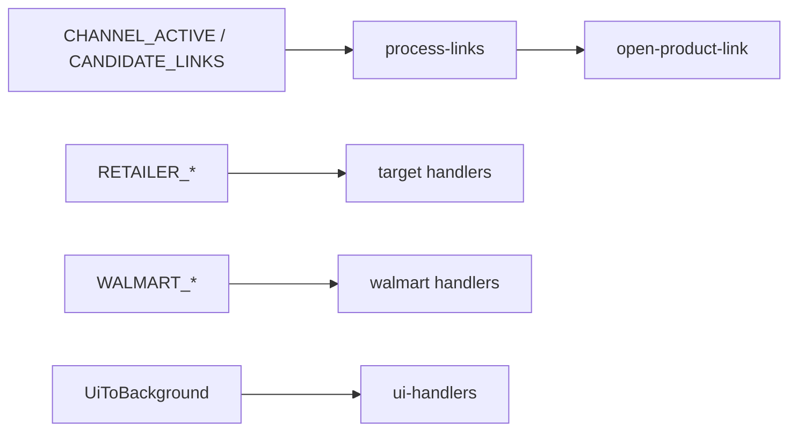

# Core extension

Chrome MV3 service worker hub — message router, link opening pipeline, shared storage/status, sender auth, side panel configuration.

## Key files

| Area | Path |
|---|---|
| Entry | `background/service-worker.ts` — gates handlers on `initPromise` (no top-level await in MV3) |
| Message router | `background/handlers.ts` → domain handlers |
| Sender auth | `background/sender-auth.ts` |
| UI messages | `background/ui-handlers.ts` |
| Status contract | `background/status.ts`, `types/status.ts` |
| Status push | `background/status-notify.ts` |
| Side panel | `background/side-panel.ts` (`configureSidePanel`) |
| Active tab | `background/window-active-tab.ts`, `lib/active-tab.ts` |
| Open tabs | `background/open-product-link.ts` |
| Runtime dedup/state | `background/runtime-state.ts` |
| Link pipeline | `lib/process-links.ts`, `lib/links.ts`, `lib/validate.ts`, `lib/affiliate-unwrap.ts` |
| Channel allowlists | `lib/channel-targets.ts`, `lib/storage.ts` |
| UI bridge | `lib/messages.ts` — side panel (`sendToBackground`, `getExtensionStatus`, `getSidePanelWindowId`, …) and Discord content (`sendCandidateLinks`, `sendChannelInactive`, …) |
| Update check | `lib/check-for-update.ts`, `lib/version.ts` |
| Types | `types/messages.ts`, `types/core.ts`, `types/index.ts` |

### Service worker lifecycle (`service-worker.ts`)

- `initPromise` gates `onMessage` handlers (no top-level await in MV3).
- `onInstalled` → `seedDefaultsIfMissing` + `configureSidePanel`.
- Startup → `configureSidePanel`, `loadWalmartRecordingState`.
- Tab listeners: Walmart auto-refresh, core dedup flush, Target retailer cleanup, Walmart recording teardown.
- Window listener: Target retailer window cleanup.
- `onSuspend` (when supported) → `flushRecentUrls()` before SW teardown.

### Shared lib (other)

`lib/blocked-domains.ts`, `lib/ignored-domains.ts`, `lib/suggestion-domains.ts`, `lib/domains.ts`, `lib/channels.ts`, `lib/spa-navigation.ts`, `lib/constants.ts`, `lib/sleep.ts`, `lib/watch.ts`, `lib/recording/element-descriptor.ts`

## Data flow

## Messages

Unions in `types/messages.ts`: `ContentToBackground`, `RetailerToBackground`, `WalmartToBackground`, `BackgroundToContent`, `UiToBackground`.

When adding or changing a message:

1. Extend unions in `types/messages.ts` (or domain types re-exported from `index.ts`).
2. Add type guard in `background/handlers.ts` (`is*ContentMessage` / `isUiMessage`).
3. Add handler in matching domain `background/handlers.ts` (or `ui-handlers.ts` for `UiToBackground`; Walmart routes via `handlers/index.ts`).
4. Update `background/sender-auth.ts` only when adding a new content-script origin domain.
5. Add/adjust tests in `tests/core/handlers-*.test.ts` or domain tests.

Background → content messages use `chrome.tabs.sendMessage` and bypass `handleMessage`. Example: `SCAN_DETECTED_DOMAINS` is sent from `ui-handlers.ts` when the side panel requests detected domains.

## Invariants

- Content scripts never open tabs — service worker does.
- Never bypass `background/sender-auth.ts`.
- Production types via `@ext/core/types/index.ts` only.

Global invariants and import rules: [AGENTS.md](../../AGENTS.md).

## Tests

`tests/core/*` — highlights:

| Area | Files |
|---|---|
| Handler routing | `handlers-discord.test.ts`, `handlers-target.test.ts`, `handlers-walmart.test.ts`, `handlers-ui.test.ts`, `handlers-retailer-auth.test.ts` |
| Link pipeline | `tests/discord/process-links.test.ts`, `tests/core/validate.test.ts`, `tests/core/open-product-link.test.ts` |
| Status / UI | `status.test.ts`, `status-notify.test.ts`, `ui-handlers-status.test.ts`, `sidepanel-layout.test.ts`, `messages.test.ts` |
| Storage / tabs | `channel-targets.test.ts`, `active-tab.test.ts`, `check-for-update.test.ts` |
