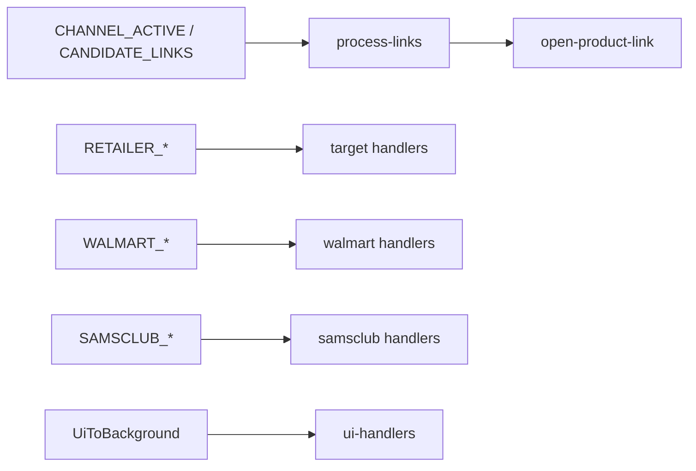

# Core extension

Chrome MV3 service worker hub — message router, link opening pipeline, shared storage/status, sender auth, side panel configuration.

## Key files

| Area | Path |
|---|---|
| Entry | `background/service-worker.ts` — gates handlers on `initPromise` (no top-level await in MV3) |
| Message router | `background/handlers.ts` → domain handlers |
| Sender auth | `background/sender-auth.ts` |
| UI messages | `background/ui-handlers.ts` |
| Status contract | `background/status.ts`, `types/status.ts` |
| Status push | `background/status-notify.ts` |
| Side panel | `background/side-panel.ts` (`configureSidePanel`) |
| Active tab | `background/window-active-tab.ts`, `lib/active-tab.ts` |
| Open links | `background/open-product-link.ts` |
| Schedule alarms | `background/schedule-alarms.ts`, `background/schedule-runtime-state.ts`, `lib/schedule.ts`, `lib/schedule-settings.ts`, `lib/schedule-session.ts` |
| Runtime dedup/state | `background/runtime-state.ts` |
| Link pipeline | `lib/process-links.ts`, `lib/links.ts`, `lib/validate.ts`, `lib/affiliate-unwrap.ts`, `lib/keywords.ts`, `lib/retailer-url.ts`, `lib/sku-watch/*` |
| Channel allowlists | `lib/channel-targets.ts`, `lib/storage.ts` |
| UI bridge | `lib/messages.ts` — side panel and Discord content helpers |
| Update check | `lib/check-for-update.ts`, `lib/version.ts` |
| Types | `types/messages.ts`, `types/core.ts`, `types/index.ts` |

### Service worker lifecycle (`service-worker.ts`)

- `initPromise` gates `onMessage` handlers (no top-level await in MV3).
- `onInstalled` → `seedDefaultsIfMissing` + `configureSidePanel`.
- Startup → `configureSidePanel`, `loadWalmartRecordingState`, `loadSamsclubRecordingState`, `syncScheduleAlarms`.
- `chrome.alarms.onAlarm` → `handleScheduleAlarm` (Target + Sam's Club scheduled start/end).
- Tab listeners: Walmart auto-refresh, core dedup flush, Target retailer cleanup, Walmart recording teardown, Sam's Club recording + automation teardown.
- Window listener: Target retailer window cleanup.
- `onSuspend` (when supported) → `flushRecentUrls()` before SW teardown.

### Shared lib (other)

`lib/blocked-domains.ts`, `lib/ignored-domains.ts`, `lib/suggestion-domains.ts`, `lib/domains.ts`, `lib/channels.ts`, `lib/spa-navigation.ts`, `lib/constants.ts`, `lib/sleep.ts`, `lib/watch.ts`, `lib/recording/element-descriptor.ts`

## Data flow

## Messages

Source of truth: `types/messages.ts`. How to add/change: `.cursor/rules/runtime-messages.mdc`.

Routing: `background/handlers.ts` → domain `background/handlers*` (Walmart and Sam's Club via `handlers/index.ts`). Background → content uses `chrome.tabs.sendMessage` and bypasses `handleMessage` (e.g. `SCAN_DETECTED_DOMAINS` from `ui-handlers.ts` on `GET_DETECTED_DOMAINS`).

## Invariants

- Content scripts never open tabs — service worker does.
- Never bypass `background/sender-auth.ts`.
- Production types via `@ext/core/types/index.ts` only.

Global invariants and import rules: [AGENTS.md](../../AGENTS.md).

## Tests

`tests/core/*` — handler routing (`handlers-*.test.ts`), link pipeline, status/UI. Cross-domain link tests: `tests/discord/process-links.test.ts`.
