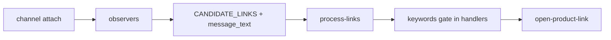

# Discord domain

Watches Discord channel tabs for product links and sends candidates to the background for allowlist filtering and tab opening.

## Key files

| Area | Path |
|---|---|
| Content entry | `content/entry.ts` |
| Session / observer | `content/session.ts` (`hookSpaNavigation`, `MESSAGE_BOOTSTRAP_QUIET_MS`), `observers.ts`, `extract.ts` |
| Domain detection | `content/detected-domains.ts`, `content/page-domains.ts` |
| DOM selectors | `content/selectors.ts` — **only** edit selectors here; bump `SELECTOR_VERSION` |
| Background handler | `background/handlers.ts` — link open (`openPassiveProductTab` / `openRetailerProductWindow` when Auto ATC enabled) |
| Link pipeline (core) | `@ext/core/lib/process-links.ts`, `links.ts`, `validate.ts`, `affiliate-unwrap.ts`, `keywords.ts` |

## Data flow

## Messages

Source of truth: [extension/core/types/messages.ts](../../core/types/messages.ts).

- Content → background: `CHANNEL_ACTIVE`, `CHANNEL_INACTIVE`, `CANDIDATE_LINKS` (optional `message_text`), `ADD_ALLOWED_DOMAIN`, `IGNORE_DOMAIN`
- Background → content: `WATCH_CONFIG`, `PING`, `SCAN_DETECTED_DOMAINS` (sent from `extension/core/background/ui-handlers.ts` on `GET_DETECTED_DOMAINS`)

## Invariants

- Bootstrap quiet period (`MESSAGE_BOOTSTRAP_QUIET_MS` = 500ms in `session.ts`) prevents historical links on load.
- Empty allowlist = observe only; `process-links` no-ops on `[]`.
- Selectors only in `selectors.ts`; bump `SELECTOR_VERSION` after manual verification.
- Thread URLs share parent channel allowlist (`parseChannelId` uses parent segment).
- Own messages are skipped (`isOwnMessage` in extract/session).
- Prefer visible message `textContent` URLs over Discord redirect `href`s.
- Side panel domain + keyword editor is Discord-surface only; settings debounce 400ms via `useChannelDiscordSettings`.
- Per-channel positive/negative keywords gate auto-open in `background/handlers.ts` (`shouldOpenByKeywords`); skipped links use history kind `keyword_skipped`.
- When per-channel **Auto ATC** is enabled, Target product links open in a separate window with automation (`shouldOpenRetailerWindow` / `openRetailerProductWindow` in core `open-product-link.ts`); other allowlisted links open as passive background tabs.

Global invariants and import rules: [AGENTS.md](../../../AGENTS.md).

## Tests

`tests/discord/*` — extract, observers, process-links, affiliate-unwrap, page-domains, blocked-domains, links

Core link pipeline tests: `tests/core/validate.test.ts`, `tests/core/open-product-link.test.ts`.

## UI

Side panel domains/keywords editor, detected links: `ui/popup/domains/discord/`. Link history uses `@shared/components/LinkHistory.tsx`.

Manifest: content script `run_at: document_idle` on `https://discord.com/channels/*`.
