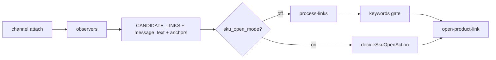

# Discord domain

Watches Discord channel tabs for product links and sends candidates to the background for allowlist filtering and tab opening.

## Key files

| Area | Path |
|---|---|
| Content entry | `content/entry.ts` |
| Session / observer | `content/session.ts` (`hookSpaNavigation`, `MESSAGE_BOOTSTRAP_QUIET_MS`), `observers.ts`, `extract.ts` |
| Domain detection | `content/detected-domains.ts`, `content/page-domains.ts` |
| DOM selectors | `content/selectors.ts` — **only** edit selectors here; bump `SELECTOR_VERSION` |
| Background handler | `background/handlers.ts` — link open (`openTargetLinkRepeated` in core `open-product-link.ts`) |
| Link pipeline (core) | `@ext/core/lib/process-links.ts`, `links.ts`, `validate.ts`, `affiliate-unwrap.ts`, `keywords.ts` |

## Data flow

## Messages

Source of truth: [extension/core/types/messages.ts](../../core/types/messages.ts). Handlers: `background/handlers.ts`. How to add/change: `.cursor/rules/runtime-messages.mdc`.

## Invariants

- Bootstrap quiet period (`MESSAGE_BOOTSTRAP_QUIET_MS` = 500ms in `session.ts`) prevents historical links on load.
- Empty allowlist = observe only; `process-links` no-ops on `[]`.
- Selectors only in `selectors.ts`; bump `SELECTOR_VERSION` after manual verification.
- Thread URLs share parent channel allowlist (`parseChannelId` uses parent segment).
- Own messages are skipped (`isOwnMessage` in extract/session).
- Prefer visible message `textContent` URLs over Discord redirect `href`s.
- `CANDIDATE_LINKS` may include optional `message_text`, `anchors`; extraction uses `messageScanRoot` (article + embed accessories).
- Global **SKU open mode** (`sku_open_mode_enabled`) switches handlers to `decideSkuOpenAction` (per-channel `watch_skus.target`); opens `target.com/p/-/A-{sku}` directly. Keywords are bypassed. History kind `sku_skipped` when no configured SKU matches.
- Side panel domain + keyword/SKU editor is Discord-surface only; settings debounce 400ms via `useChannelDiscordSettings`.
- When per-channel **Auto ATC** is enabled, Target product links open via `openTargetLinkRepeated` in core `open-product-link.ts` (repeat count from global `retailer_link_open_count`, default 1); other allowlisted links open via `openPassiveProductLink` in a new window or background tab per global `open_links_in_window` setting (default on).

Global invariants and import rules: [AGENTS.md](../../../AGENTS.md).

## Tests

`tests/discord/*`

## UI

Side panel domains/keyword/SKU editor, detected links: `ui/popup/domains/discord/`. Link history uses `@shared/components/LinkHistory.tsx`.

Manifest: content script `run_at: document_idle` on `https://discord.com/channels/*`.
