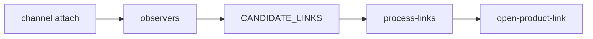

# Discord domain

Watches Discord channel tabs for product links and sends candidates to the background for allowlist filtering and tab opening.

## Key files

| Area | Path |
|---|---|
| Content entry | `content/entry.ts` |
| Session / observer | `content/session.ts`, `observers.ts`, `extract.ts` |
| Domain detection | `content/detected-domains.ts`, `content/page-domains.ts` |
| DOM selectors | `content/selectors.ts` — **only** edit selectors here; bump `SELECTOR_VERSION` |
| Background handler | `background/handlers.ts` |
| Link pipeline (core) | `@ext/core/lib/process-links.ts`, `links.ts`, `validate.ts` |

## Data flow

## Messages

Source of truth: [extension/core/types/messages.ts](../../core/types/messages.ts).

- Content → background: `CHANNEL_ACTIVE`, `CHANNEL_INACTIVE`, `CANDIDATE_LINKS`, `ADD_ALLOWED_DOMAIN`, `IGNORE_DOMAIN`
- Background → content: `WATCH_CONFIG`, `PING`, `SCAN_DETECTED_DOMAINS`

## Invariants

- Bootstrap quiet period (`MESSAGE_BOOTSTRAP_QUIET_MS`) prevents historical links on load.
- Empty allowlist = observe only; `process-links` no-ops on `[]`.
- Selectors only in `selectors.ts`; bump `SELECTOR_VERSION` after manual verification.
- Thread URLs share parent channel allowlist; own messages are skipped.

Global invariants and import rules: [AGENTS.md](../../../AGENTS.md).

## Tests

`tests/discord/*`

## UI

Side panel domains editor, detected links, link history: `ui/popup/domains/discord/`
