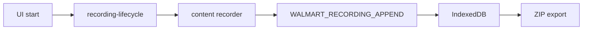
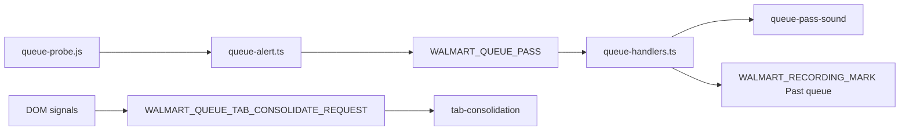

# Walmart domain

Manual drop-day research recorder on `walmart.com` tabs. Multi-tab global session, IndexedDB persistence, ZIP export. **No auto-checkout, no Discord link opening.**

Also provides optional Walmart tab helpers (separate from recording):

- **Hard-refresh auto-refresh** — interval reload on open Walmart tabs.
- **Queue helpers** — page-context queue probe, pass alert (optional sound), duplicate `/qp` tab consolidation, throttle refresh on queue pages.

## Key files

| Area | Path |
|---|---|
| Content entry | `content/entry-early.ts` (`document_start` — injects queue probe), `content/entry.ts` (`document_idle`) |
| Session attach | `content/session.ts` |
| Queue (content) | `content/queue-alert.ts`, `content/tab-consolidation.ts`, `content/throttle-refresh.ts` |
| Auto refresh | `content/auto-refresh.ts`, `background/handlers/auto-refresh.ts`, `background/auto-refresh-tab-events.ts` |
| Recorder | `content/recorder/*` |
| Background handlers | `background/handlers/{index,shared,recording-lifecycle,tab-events,append,ui-messages,content-messages,auto-refresh,queue-handlers}.ts` |
| Background support | `background/runtime-state.ts` (`tryAcquireExport`, recording metrics), `background/tabs.ts`, `background/tab-message.ts` |
| IDB / export | `lib/idb/*`, `background/export.ts` (uses `downloads` permission) |
| Page probes | `lib/page-probe-bridge.ts` → `public/injected/walmart-research-probe.js` (recording); `lib/queue-probe-bridge.ts` → `public/injected/queue-probe.js` (always on Walmart tabs) |
| Queue (lib) | `lib/queue-pass.ts`, `lib/queue-pass-sound.ts`, `lib/tab-consolidation.ts`, `lib/throttle-page.ts` |
| Types | `types/walmart.ts` (re-exported via `@ext/core/types/index.ts`) |
| Docs / scripts | `docs/WALMART_RECORDING.md`, `docs/WALMART_AUTOMATION.md`, `scripts/debug-walmart-tab-pills.mjs` |

## Recording flow

## Queue flow

## Handler modules

| Module | Role |
|---|---|
| `recording-lifecycle.ts` | Start/stop global session |
| `append.ts` | Batch ingest + limits |
| `content-messages.ts` | Content-originated messages (routes queue + auto-refresh) |
| `ui-messages.ts` | Side panel actions |
| `tab-events.ts` | Tab open/close/update |
| `auto-refresh.ts` | Hard-refresh interval config + sync |
| `queue-handlers.ts` | Queue pass notify + tab consolidation |
| `shared.ts` | Shared handler utilities |

## IDB stores

`lib/idb/session-store.ts`, `event-store.ts`, `pages-store.ts`, `endpoints-store.ts`, `schema.ts`

## Lib barrel

Core/UI-core import `@ext/domains/walmart/lib/index.ts` only (host, open-tab highlights, tab labels, auto-refresh helpers).

Other lib modules (`export-bundle.ts`, `recording-limits.ts`, `network-redact.ts`, etc.) are domain-internal.

## Messages

Source of truth: [extension/core/types/messages.ts](../../core/types/messages.ts). Handlers: `background/handlers/*`. How to add/change: `.cursor/rules/runtime-messages.mdc`.

`WALMART_RECORDING` UI action union (`start` | `stop` | `mark` | `clear` | `export`) lives in `types/walmart.ts`.

## Invariants

- One global recording session across all Walmart tabs.
- Manual research only — no auto-checkout, no Discord link opening.
- Content never writes IndexedDB — background handlers persist via IDB lib.
- Inject research probe only while recording (`lib/page-probe-bridge.ts`); queue probe loads on every Walmart tab via `entry-early.ts`.
- Queue pass dedup uses tab `sessionStorage` (`WALMART_QUEUE_PASS_SEEN_KEY`); optional sound via `sounds/queue-pass.mp3`.
- Export mutex (`tryAcquireExport`); extend existing handler modules, do not merge into monolith.

Manifest: Walmart early (`document_start`) + main (`document_idle`) on `walmart.com` / `www.walmart.com`.

Global invariants and import rules: [AGENTS.md](../../../AGENTS.md).

## Deep docs

- [WALMART_RECORDING.md](docs/WALMART_RECORDING.md) (primary)
- [WALMART_AUTOMATION.md](docs/WALMART_AUTOMATION.md) (future automation notes)

## Tests

`tests/walmart/*`

## UI

Research section + tab pills: `WalmartResearchSection`. Auto-refresh and queue settings: `WalmartAutoRefreshSection` (with `useWalmartQueueSettings`). Shown when `status.walmart_tab_detected` — see [ui/popup/core/AGENTS.md](../../../ui/popup/core/AGENTS.md).
