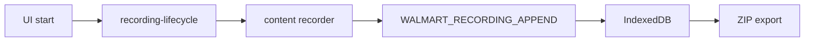

# Walmart domain

Manual drop-day research recorder on `walmart.com` tabs. Multi-tab global session, IndexedDB persistence, ZIP export. **No auto-checkout, no Discord link opening.**

Also provides optional hard-refresh auto-refresh on Walmart tabs (separate from recording).

## Key files

| Area | Path |
|---|---|
| Content entry | `content/entry.ts` |
| Session attach | `content/session.ts` |
| Auto refresh | `content/auto-refresh.ts`, `background/handlers/auto-refresh.ts`, `background/auto-refresh-tab-events.ts` |
| Recorder | `content/recorder/*` |
| Background handlers | `background/handlers/{index,shared,recording-lifecycle,tab-events,append,ui-messages,content-messages,auto-refresh}.ts` |
| Background support | `background/runtime-state.ts` (`tryAcquireExport`, recording metrics), `background/tabs.ts`, `background/tab-message.ts` |
| IDB / export | `lib/idb/*`, `background/export.ts` (uses `downloads` permission) |
| Page probe | `lib/page-probe-bridge.ts` → `public/injected/walmart-research-probe.js` |
| Types | `types/walmart.ts` (re-exported via `@ext/core/types/index.ts`) |
| Docs / scripts | `docs/WALMART_RECORDING.md`, `docs/WALMART_AUTOMATION.md`, `scripts/debug-walmart-tab-pills.mjs` |

## Recording flow

## Handler modules

| Module | Role |
|---|---|
| `recording-lifecycle.ts` | Start/stop global session |
| `append.ts` | Batch ingest + limits |
| `content-messages.ts` | Content-originated messages |
| `ui-messages.ts` | Side panel actions |
| `tab-events.ts` | Tab open/close/update |
| `auto-refresh.ts` | Hard-refresh interval config + sync |
| `shared.ts` | Shared handler utilities |

## IDB stores

`lib/idb/session-store.ts`, `event-store.ts`, `pages-store.ts`, `endpoints-store.ts`, `schema.ts`

## Lib barrel

Core/UI-core import `@ext/domains/walmart/lib/index.ts` only (host, open-tab highlights, tab labels, auto-refresh helpers).

Other lib modules (`export-bundle.ts`, `recording-limits.ts`, `network-redact.ts`, etc.) are domain-internal.

## Messages

Source of truth: [extension/core/types/messages.ts](../../core/types/messages.ts).

- Content → background: `WALMART_RECORDING_APPEND`, `WALMART_RECORDING_REATTACH`, `WALMART_PING`, `WALMART_GET_AUTO_REFRESH_CONFIG`, `WALMART_SYNC_AUTO_REFRESH`, `WALMART_HARD_RELOAD`
- Background → content: `WALMART_RECORDING_START`, `WALMART_RECORDING_STOP`, `WALMART_RECORDING_MARK`, `WALMART_AUTO_REFRESH_CONFIG`
- UI: `WALMART_RECORDING` (action union: `start` \| `stop` \| `mark` \| `clear` \| `export` in `types/walmart.ts`), `SET_WALMART_AUTO_REFRESH_ENABLED`, `SET_WALMART_REFRESH_INTERVAL`

## Invariants

- One global recording session across all Walmart tabs.
- Manual research only — no auto-checkout, no Discord link opening.
- Content never writes IndexedDB — background handlers persist via IDB lib.
- Inject research probe only while recording (`lib/page-probe-bridge.ts`).
- Export mutex (`tryAcquireExport`); extend existing handler modules, do not merge into monolith.

Global invariants and import rules: [AGENTS.md](../../../AGENTS.md).

## Deep docs

- [WALMART_RECORDING.md](docs/WALMART_RECORDING.md) (primary)
- [WALMART_AUTOMATION.md](docs/WALMART_AUTOMATION.md) (future automation notes)

## Tests

`tests/walmart/*`

## UI

Research section, tab pills, auto-refresh: `ui/popup/domains/walmart/`
